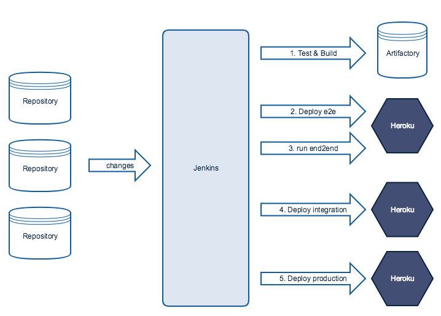

# Disaster Recovery Day

Wir Entwickler bei Ideas glauben fest an das Mantra ["You build it, you run it"](https://queue.acm.org/detail.cfm?id=1142065). Auch wenn der 
von Amazons Chief Technology Officer Werner Vogel Spruch mitlerweile mehr als 12 Jahre als ist, beschreibt es immer noch genau die DevOps Kultur 
die wir hier leben. Neben DevOps gehört der "agile" Gedanke von kontinuierlicher Verbesserung und schnellem Feedback zu unser täglichen Arbeit.

Beim Entwickeln von Software geben uns Test schnelles Feedback. Unser Continious-Intergrations-System sendet bei der fehlgeschlagenen 
Integration Chat- und Email-Nachrichten. Doch was ist mit dem Testen der Build-Infrastruktur, die für moderne Software-Entwicklung nötig ist?   

Um diese Frage klar beantworten zu können, hat sich das Team Enterprise entschieden einen "Disaster-Recovery" Tag durchzuführen. 

- DevOps Kultur 
- Theoretisches Wissen erproben
- Wissenssilos vermeiden
- Wissenlücken identifizieren und ggf. schließen
- Kontinuierlich besser werden
- Sicheres Gefühl im Umgang mit unserem BUILD Setup

## CI/CD Done by team Enterprise

Das Team Enterprise betreut eine größere Software-Platform namens "ContentPool", die aus einem Dutzend Services besteht. Jeder Service hat sein
eigenes Repository. Unser CI/CD System [Jenkins](https://jenkins.io/) lauscht auf Änderungen in den Repositories und startet die Pipeline. Die
hohe Testabdeckung gibt uns das Vertrauen jede noch so kleine Änderung automatisch von Jenkins auf Produktion ausgerollen zu lassen. 

Die Pipeline für jeden Service besteht aus folgenden Schritten:
 * __Test & Build__: Jenkins führt die Tests der Anwendung aus und veröffentlicht ein neues Artefakt bei Artifactory.
 * __Deploy & run end2end:__ Das neue Artefakt wird bei Heroku auf der End2End Stage deployed und danach die End2end Test ausgeführt. 
 * __Deploy integration__: Wenn die End2End Test erfolgreich passiert wurden, wird die Anwendung in den Integrationsumgebung deployed.
 * __Deploy production__: Nach dem deployment auf der Integrations-Stage wird die Anwendung in die Produktionsumgebung deployed. 

Wie in jeder anderen Firma auch, kommen und gehen Kollegen. Auch hat sich unsere Firmenstruktur von dedizierten Silo-Teams hin zu cross-funktionalen Teams verändert. Der vom Enterprise betreute Jenkins existierte schon vor dem Team und wurde von mehreren Jahren von einem dedizierten Operations-Team betreut. Innerhalb der letzten Monate haben wir schrittweise das Wissen über Jenkins, dem Slave-Setup, die Provisionierung und die wie Ausführung auf AWS als EC2 Instanzen genau funktioniert in das Team getragen. In Form von ["technischen User Stories"](http://rgalen.com/agile-training-news/2013/11/10/technical-user-stories-what-when-and-how) ist so unser aktuelle Jenkins-Setup entstanden. 

Wir waren uns alle sicher, dass trotz des Wissenstransfers das CI System unsere größte Schwachstelle ist. Ohne CI System können wir keine Änderungen in Produktion nehmen und wären damit handlungsunfähig. Was passiert also, wenn eines Morgen Jenkins nicht mehr funktioniert, die EC2 Maschine nicht mehr läuft?

## Jenkins Setup in great Detail

TODO

Jenkins selbst wird von uns als Team betreut und ist unser wichtigetes Werkzeug da jede automatisierbare Aktion durch einen Jenkins-Job abgebildet wird. 
Jenkins selbst wird bei Amazon WebServices als EC2 Instanz ausgeführt. Für die Ausführung der einzelnen Jobs werden bei Bedarf automatisch 
Jenkins-Slaves hochgefahren, die als Docker-Container bei AWS Fargate ausgeführt werden. Das Erstellen und Pflegen des Jenkins-AMIs und der 
Docker-Container übernimmt das Team selbst. 

- Tools: JenkinsFiles, Docker, AWS ECS/Fargate, Packer, Terraform, Heroku-CLI

# D(isaster)-Day - Jenkins ist kaputt

- Preparation: Chaos monkey macht alles kaputt (unbeteiligt, nicht Ansprechbar im HO verschwunden)
- 9.30 Jenkins ist aus
ec2 instance is dead
dns record was missing
wrong ami?

10:20 jenkins toolbelt repo 
packer to build ami and deploy it to amazon

10:40 what did packer do?
correct efs, we deleted original backup

10:41 jenkins is alive (but not data)

11:00 Coffee
terraform rename fail, name mismatch confusion, aws termination protection?

12:00 where is the jenkins backup?
s3 bucket downloading / s3 python backup script

12:15 Lunch

13:00 restore script done?
docker efs mount fail
efs is sooo slow
s3 script fail
tar manual

18:00 let's go home

9:00 backup is alive
jenkins pid results in "already instance running" -> manual restart

10:00 DONE

## What we've learned 

Erleben zu können, wie ein Team gemeinsam ohne viel Aufregung ein Problem professionell löst ist unbezahlbar. Die Wiederherstellung vom Jenkins war ein solches Erlebnis. Auch wenn wir das angepeilte Ziel von 3 Stunden mehr als nur verfehlt haben, lief der Jenkins am nächsten Tag verlässlich!

Trotz der ausführlichen Dokumentation währen der letzten Monate hatten sich immer noch einige Lücken aufgetan. Diese wurden während der Übung ergänzt. Wichtige Todos, die im Laufe des Tages uns eingefallen sind, wurden sofort aufgeschrieben und als technische Story in unser Backlog aufgenommen.

- document your steps and create action items on the fly
- untar takes longer than tar
- do not backup logs/workspaces/* (keep backups small, network and i/o is slow and expensive)
- name your instances according to purpose
- test your backup (and restore) solution before disaster happens
- do it again (and again)
- plan your disaster day and inform management

## And now?
- Wir haben vertrauen in unsere Lösung gewonnen
- Wir haben Wissenslücken identifiziert und geschlossen
- Disaster? No disaster!
- Mehr automation? Or less? 
