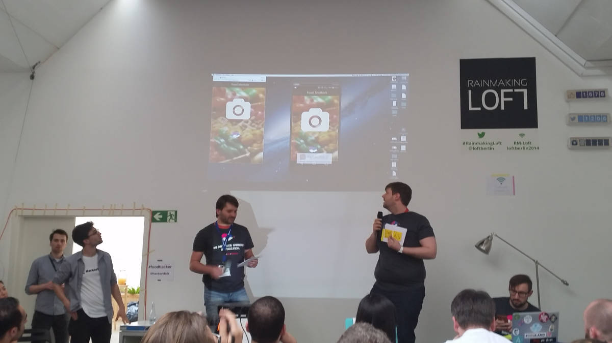
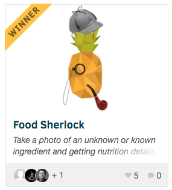
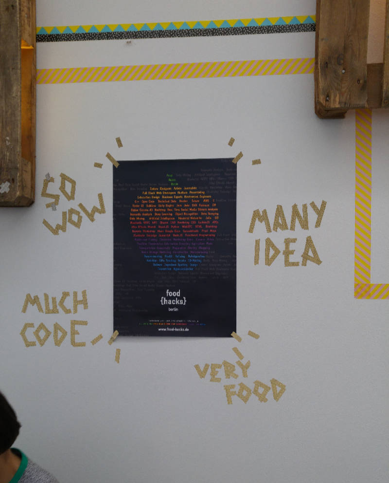
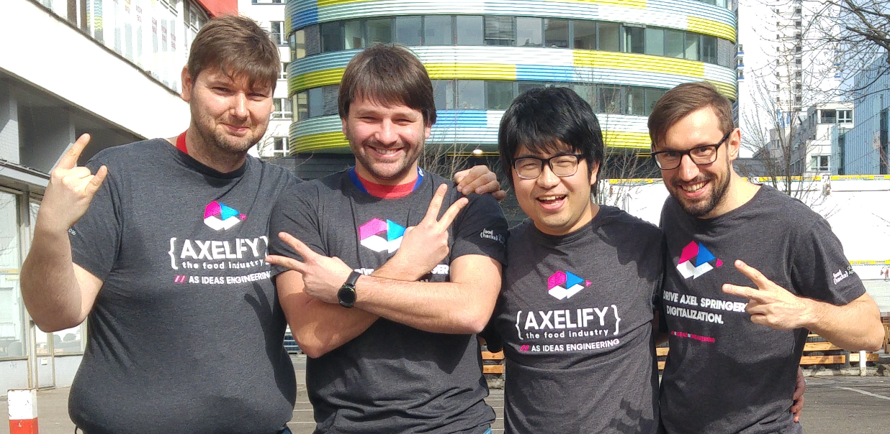
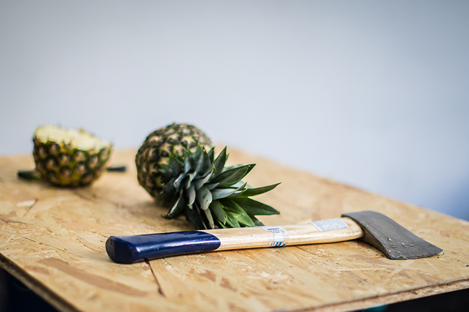
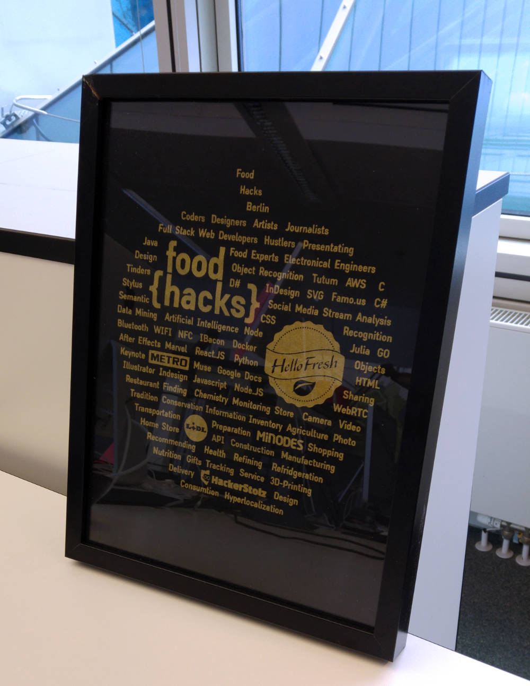
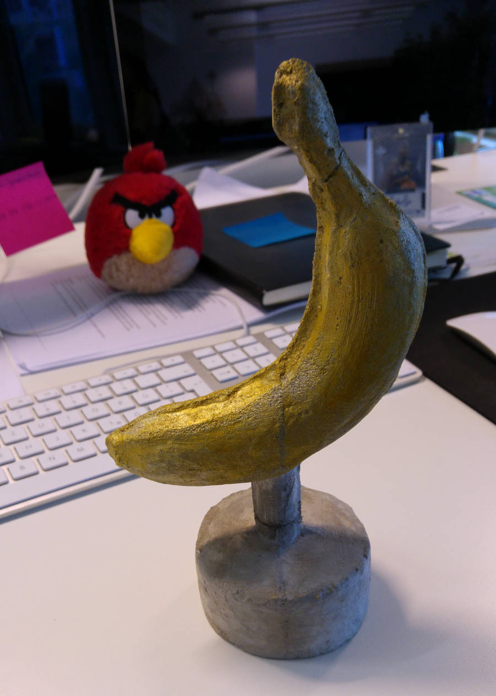
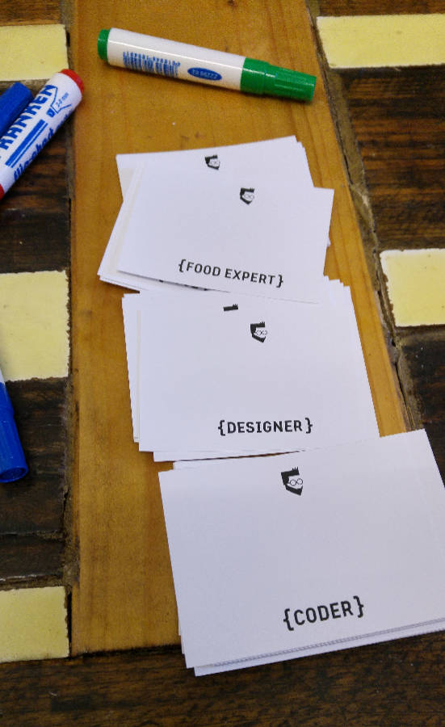

Ideas für Hackathons
====================

Hallo Welt,

Hackathons machen enorm viel Spaß und man kann dabei mehr lernen als in mehreren Monaten normaler Arbeit. Wir waren dieses Jahr an zwei Wochenenden bei zwei Hackathons, hatten enorm viel Spaß und haben drei Preise gewonnen. _Dazu ist unsere [iPool-API](http://www.ipool.asideas.de/) hervorragend dokumentiert._

**Hackathons?!**

Routine killt jede Form von Kreativität. Ein Hackathon ist ein so besonders Ereignis, dass einem zu ganzen neuen Denkweisen bringt und auch wirklich eine langfristige Wirkung hat. Es ist nicht nur, dass man in nur 24h etwas fertiges und benutzbares schafft, dabei neue Wege erkundet, es ist auch die Motivation, die man mitnimmt. Nach einem Hackathon möchte man so viel ausprobieren, es ist wie eine Begeisterung, die ansteckt. Es ist außerdem ein Team-Event: Die Zusammenarbeit mit den anderen hat unglaublich viel Spaß gemacht. Man hat zusammen nicht nur etwas geschaffen, man hat zusammen etwas erlebt. So viele Leute, die man kennengelernt hat, so viele Gespräche und neue Eindrücke, die man in so kurzer Zeit bekommen hat. Ich habe auch den Eindruck, dass sich sehr viele Chancen ergeben haben durch die Gespräche die man hatte. Ich habe viele Leute von AS kennengelernt, z.B. Peter Buhr, der früher bei Ideas gearbeitet hat. Ich habe mit den Leuten von Tealium (mit denen AS ein großes DIP-Projekt macht) mitten in der Nacht live-debugging Sessions ihres Codes gemacht und es waren so viele Leute, dass es schwer fällt, alles zusammenzufassen. 

Wir haben natürlich geschlafen – ich sogar 8h – nur Thomas hat beim Mediahackday durchgemacht (schaut euch dazu unbedingt das [Video](https://t.co/RLgD17lynH) an). Die Veranstaltung begannen jeweils Samstag um 9 Uhr, dann gab es Vorstellungen, Intros, Teamfindung und das eigentliche Hacken ging von Samstag 12 Uhr bis Sonntag 12 Uhr. Danach waren die pitches, 2 bzw. 3 Minuten und gegen 15 Uhr jeweils die Siegerehrungen. Und natürlich gab es permanent Essen, Eis, Süßigkeiten, Kuchen, Mitternachtssnacks – also alles immer super organisiert, man muss nichts mitbringen, die Veranstalter haben sich immer um alles gekümmert.

**food{hacks}**

Und wer sind die richtigen Hacker um sie im T3N Artikel als Titelbild zu haben? Korrekt: **Wir.** [http://t3n.de/news/food-hacks-vier-smarte-ideen-693850](http://t3n.de/news/food-hacks-vier-smarte-ideen-693850)/

Hier wird Essen gehackt:

Beim food{hacks} Hackathon ging es um das Thema Essen. Nichts ist so analog wie Nahrung und Essen und wie der CEO von Hello Fresh sagte: “Mir kann keiner sagen, dass die Branche digitalisiert ist”. Der Hackathon hatten Teilnehmer aus über 20 Ländern, über 20 Teams und einen sehr hohen Anteil an Frauen. Dazu war die Organisation hervorragend, alles war geschmückt, überall hingen individuelle und unterschiedliche Poster und Deko rum. Organisiert wurde alles von Hockerstolz e.V., einem recht jungen Verein aus Mannheim. Begrüßt wurden wir mit einem Goody-Bag mit Schürze, Energy Drink, Kaltgepresstem Öl, einer Power Bank, Kochbuch, Zeitschrift und pro Team mit einer riesigen Süßigkeiten Box. Yeah! Es gab keine Cola, kein Red Bull, sondern eher unbekannte Getränke von Proviant und anderen kleineren Anbietern. Alles ein bisschen alternativ hier.

Die Sponsoren haben dabei für bestimmte Sonderpreise einzelnen Challenges ausgerufen z.B. Hello Fresh mit “finden neue Ideen Rezepte zu entdecken” oder Lidl mit “Mobiles Einkaufen ist nur eine Umsetzung der Desktop-Shops, aber nicht angepasst an mobiles Nutzungsverhalten. Wie kann man mit mobilen Geräten anders einkaufen?”. Unsere Lösung verwendet dabei die Imagga-API zur Bildanalyse und wir haben damit auch die Imagga-Challenge und eine GoPro für unser Team gewonnen 😉 Als Preis gab es dazu eine wunderbare Bananen-Skulptur.   

Try it out: [https://food-hacks-ideas.herokuapp.com/](https://which-ad-are-you.herokuapp.com/)

Beschreibung: [http://devpost.com/software/which-add-are-you](http://devpost.com/software/which-add-are-you)

**Mediahackday**

Der von Axel Springer organisierte Mediahackday findet immer zwischen den einzelnen Startup-Batches im Plug & Play Accelerator statt. Im Gegensatz zum food{hacks} gab es nur 11 Teams, viele Firmen, nur drei Frauen und der Altersdurchschnitt war deutlich höher. Hier haben viele Teilnehmer den Hackathon zu ernst genommen. Ein leichter Beigeschmack bleibt auch, da man den Source Code nicht offen legen musste und das Gewinner Team (dir direkt hinter uns saßen) den Eindruck erweckte, dass sie mit einer fertigen Lösung gekommen sind und bereits vorher viel daran gearbeitet hatten. Spaß hat es dank unserem tollen Team trotzdem gemacht – und das nicht zu wenig. Es gab tonnenweise Red Bull, Club Mate und Cola.

Der iPool war auch API-Partner, leider hat die API nicht wirklich zum Thema gepasst und keiner hat die API benutzt 🙁 Nachdem ich bei etlichen API-Vorstellungen war und von sehr vielen APIs auch wieder an diesem Wochenende die Doku gelesen haben – der iPool hatte bisher mit die beste Dokumentation gehabt. Echt super! Und nach Julians hervorragendem Vortrag zur API weiß ich endlich auch, was der iPool kann und habe total viel Lust ganz viele Dinge damit umzusetzen!

Try it out: [https://which-ad-are-you.herokuapp.com/](https://which-ad-are-you.herokuapp.com/)

Beschreibung: [http://devpost.com/software/food-sherlock-x8jlad](http://devpost.com/software/food-sherlock-x8jlad)

Artikel im inside.net: [http://insidenet.asv.local/inside\_news/in\_inside\_news\_26814154.html](http://insidenet.asv.local/inside_news/in_inside_news_26814154.html)

Video mit der Zusammenfassung: [https://t.co/RLgD17lynH](https://t.co/RLgD17lynH)

**_Am Ende noch ein Riesen Dank an Martin, Marco, Liang, Thomas und Julian – es war mir eine große Freude! _**

Viele Grüße

Sebastian

PS: Falls ihr sehen wollt, was die anderen Teams gemacht haben, dann schaut [hier](http://food-hacks.devpost.com/submissions) und [hier](http://media-hackday-advertising-3541.devpost.com/submissions).