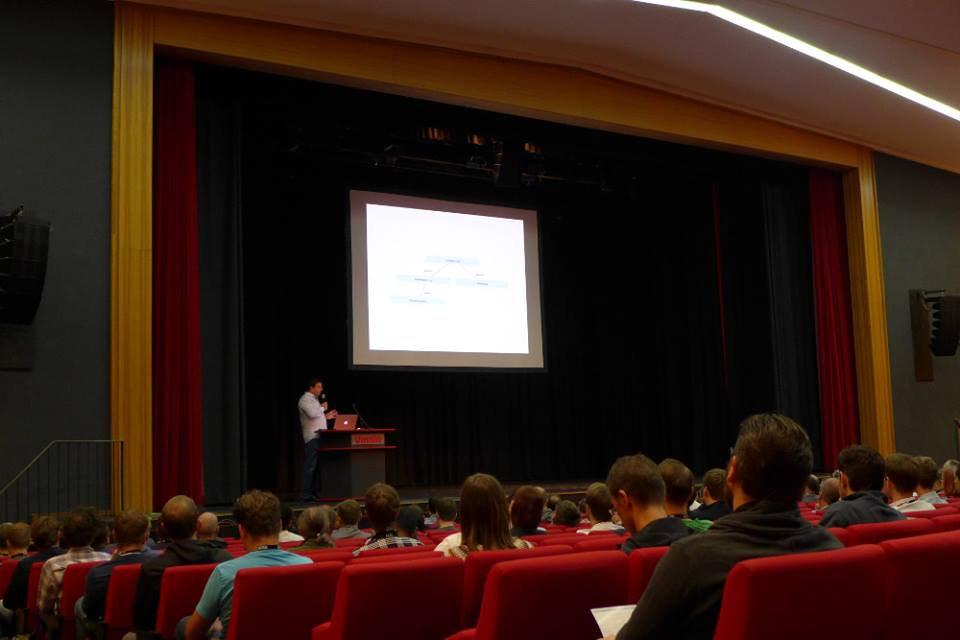
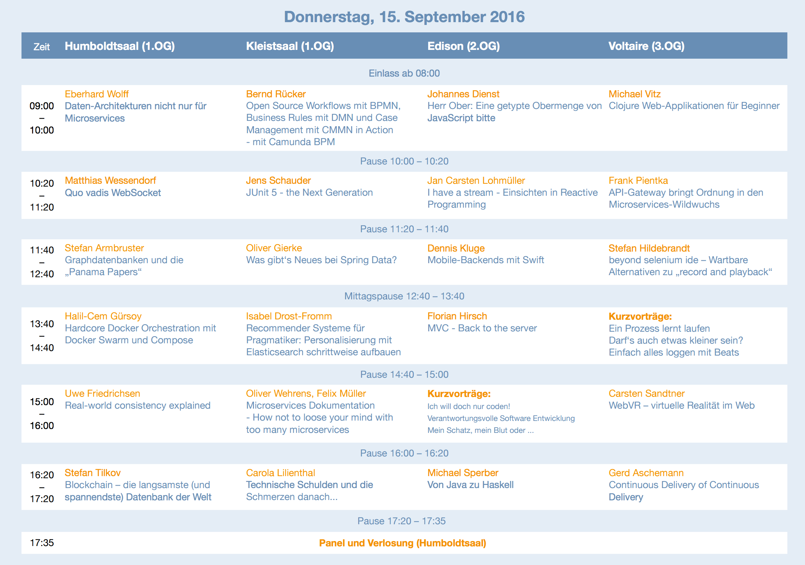
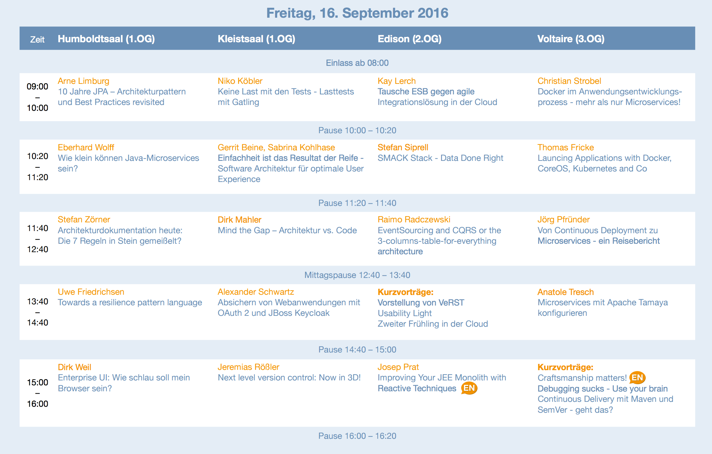

BED-CON 2016 – Das Berliner Familientreffen der Java Community
==============================================================

Das jährliche Familientreffen der Berliner Java Community hat wieder stattgefunden – die Berlin Expert Days, kurz einfach BED-CON genannt. Da die Konferenz in Berlin stattfindet und nur zwei Tage geht, gehört sie einfach zu den bequemsten Konferenzen für Berliner. Was man auch den Teilnehmern anmerkt: Bereits beim Ankommen erkennt man, dass dies eine IT-Konferenz ist. Es gibt nur männliche Softwareentwickler, vorzugsweise etwas älter und es wird nur deutsch gesprochen. Der Frauenanteil liegt bei etwa 2-4%. Schade eigentlich, andere Konferenzen zeigen, wie es besser geht.

Dazu der Running-Gag der Konferenz, der von einigen Vortragende auch aufgegriffen wurde: In jedem Vortrag wurde Docker erwähnt.

[https://www.youtube.com/watch?v=rXq3p-cniKM](https://www.youtube.com/watch?v=rXq3p-cniKM)

Ein paar Dinge, die ich mitgenommen habe
========================================

*   [Zuul](https://github.com/Netflix/zuul): Wenn ihr nicht wisst, was Zuul ist oder von einem API-Gateway noch nichts gehört habt, dann solltet ihr euch das anschauen. Auch dieses Jahr war Netflix wieder eines der großen Vorbilder, die zeigen, wie man moderne Anwendungen entwickelt. Besonders spannend ist auch die [SimianArmy](https://vmprophet.files.wordpress.com/2015/08/simianarmy.png) von Netflix. Das ist die Sammlung der ganzen “Monkeys”, die zufällige Fehler verursachen und z.B. die Nichterreichbarkeit eines gesamten Bundesstaates oder Rechenzentrums simulieren.
*   [Gatling](http://gatling.io/): JMeter ist tot, lang lebe Gatling. Ich persönlich mag JMeter noch immer, aber es sind zwei sehr unterschiedliche Ansätze.
*   [AWS-Lambda](https://aws.amazon.com/de/lambda/details/): So lagert man heute leichtgewichtig Funktionen in die Cloud aus.
*   JUnit5 macht alles neu und anders. Es ist quasi ein Rewrite von JUnit4 mit neuen (!) Annotationen. Es bleibt aber abwärtskompatibel.
*   [SMACK](https://blog.codecentric.de/2016/05/der-smack-stack-zum-anfassen/) ist zwar ein Begriff, der wohl am ehesten aus den Marketing Abteilungen großer IT Dienstleister stammt, beschreibt aber auch einen sehr eleganten Lösungsansatz (Spark, Mesos, Akka, Cassandra, Kafka), um Daten RICHTIG zu verarbeiten. Leider zeigen wohl Praxiserfahrungen, dass allein das Aufsetzen der Infrastruktur eine Woche in Anspruch nehmen kann. Mit dem mal eben “losSMACKen” wird es wohl also nichts ohne das entsprechende Zeitbudget.
*   [JBoss Keycloack](https://github.com/keycloak/keycloak): JBoss, das klingt eigentlich nach schwergewichtigem Enterprise Kram. JBoss Keycloack hingegen scheint ein richtig nettes Spielzeug für unser tägliches Arbeiten zu sein. Eine fully fledged SingleSignOn Applikation alá CAS auf Java & WildFly Basis, mit zusätzlichem Admin GUI zum Konfigurieren des gesamten Register & Login Flows, Enterprise Integrationen (LDAP, Kerberos), bestehenden Client-Implementierungen in AngularJs, Spring etc. pp. – wird im nächsten passenden Projekt direkt mal ausprobiert.

=======================================================================================================

Hat sich die BED-CON gelohnt?
=============================

Sie würde sich schon lohnen, allein durch den familiären Charakter und die ganzen Menschen, die man wieder trifft oder neu kennenlernt. Auch ist das Preisleistungsverhältnis einfach unschlagbar – für unter 100€ im Early-Bird-Tarif bekommt man zwei Tage Konferenz. Leider hat die Qualität der Vorträge dieses Jahr etwas gelitten. Insgesamt war ich leicht enttäuscht – die Auswahl der Themen war nicht ganz gelungen, alles wirkte etwas liebloser und im Endeffekt  etwas angestaubt.

Der Inhalt der Vorträge hat sich kaum unterschieden zum letzten Jahr, viele Dinge waren nicht State-of-the-Art: Keine Vorträge zu alternativen JVM-Sprachen, wenig zum Frontend, kaum technisch spannende Vorträge. Besonders schlecht war dieses Jahr auch die Panel-Diskussion – eine kurze lieblose Pflichtveranstaltung. Ein sehr starker Kontrast zum letzten Jahr, wo die Diskussion eines meiner Highlights war.

Für das nächste Jahr werde ich bei der Auswahl der Konferenzen darauf achten, dass ich zu einer Konferenz gehe, die auf Englisch ist und ein besseres Vortragsprogramm mit mehr Abwechslung bietet. Docker ist auf die Dauer dann doch irgendwann langweilig.

Vorteile:

*   Günstig, dazu gibt es Kaffee, Cola und Brötchen
*   Ein paar Perlen an Vorträgen sind immer dabei
*   Man trifft viele Kollegen aus der Berliner Community oder lernt neue Menschen kennen
*   Sehr familiäre Atmosphäre

Nachteile:

*   Schlechter Kaffee und die Brötchen sind immer super schnell alle
*   Teilweise veraltete, manchmal lieblos vorgetragene Themen bei den Vorträgen

Tag #1: Donnerstag
==================

Die BED-CON hat keine Key-Notes und keine Einführungsveranstaltung – es geht direkt mit Vorträgen los. Den ersten Vortrag von Eberhard Wolff kann man noch am Ehesten einer Key Note zuordnen – er spricht über Daten-Architektur und Microservices und ich finde, dass diesen Vortrag jeder hören muss. Wo landen meine Daten und wie schneide ich meine Datenbank?

Mein zweiter Vortrag ist JUnit5: Ich wusste vorher noch nichts davon und in diesem Vortrag wurde alle Neuerungen super zusammengefasst. Ingesamt ändert sich alles – neue Annotationen und alles neu geschrieben, dafür aber abwärtskompatibel.

Weiter geht es mit What’s new in Spring Data? – spannend ist nicht einfach der eigentliche Inhalt, sondern eher die Einblicke, die man in die interne Entwicklung von Spring Boot und Spring Data bekommt, da Oliver Gierke festangestellt bei der Dach-Firma von Spring ist und hauptverantwortlich an Spring Data entwickelt.

Weiter geht es mit den Kurzvorträgen, ein wie immer tolles Format mit drei Vorträgen mit jeweils 15 Minuten: Im ersten geht es darum, wie man einen Lego Mindstorm Roboter mit BPM ansteuert, der zweite Vortrag ist eine Einführung in AWS Lambda und im dritten geht es um Logging und die neue Technologie von Elastic mit dem Namen Beats. Nette Info: Aus dem ELK-Stack wird der ElasticStack. Beats sind dabei eine leichtgewichtige Ergänzung oder Alternative zu Logstash.

Kurzvorträge: Ich will doch nur coden! Verantwortungsvolle Softwareentwicklung, Mein Schatz, mein Blut oder doch nur die Nachrichten von gestern.

Der sechste Vortrag am Donnerstag zählt zu meinen Highlights: Wie funktionieren eigentlich die Blockchain und Bitcoins. Stefan Tilkov von innoq ist nicht nur ein verdammt guter Redner, auch inhaltlich ist dieser Vortrag absolut überzeugend.

Am Ende fand noch als Abschluss des Tages eine Panel-Diskussion statt. Geredet wurde nur etwa 30 Minuten über die Frage, wann Software denn produktionsreif ist. Leider wirkte die ganze Diskussion wie eine traurige Pflichtveranstaltung bis zur Überbrückung der Verlosung. Letztes Jahr war die Panel-Diskussion deutlich besser, wurde systematisch geführt und ich konnte sehr viel mitnehmen. Warum wurde nicht wie letztes Jahr diskutiert, was die aktuelle Trends sind oder welche Bücher man lesen sollte?

Tag #2: Freitag
===============

Mein erster Vortrag war Stresstests mit Gatling, dabei bin ich großer Fan von JMeter. Der Vortrag ist wirklich gut, ein sehr gelungene Einführung in Gatling. Leider wenig objektiv, ich finde es schade, dass viele so auf JMeter rumhacken und so tun, als läge das irgendwie an XML. Damit hatte ich in mehreren Projekten, in denen ich JMeter eingesetzt habe, noch nie zu tun.

Eberhard Wolff hält auch heute wieder einen Vortrag im Hauptsaal. Ich habe das Gefühl, dass er eigentlich jedes Jahr der gefühlte Hauptredner ist und jeden Tag einen Vortrag hält. Er stellt vier Möglichkeiten für sehr kleine Java Microservices vor: AWS Lambda, OSGi, JaveEE auf Application Servern und Docker mit Fat Jars. Dabei werden vor und Nachteile diskutiert, ohne eine klare Empfehlung zu geben. Was soll man dazu noch sagen?

Der jährliche schlechte Vortrag zu Architekturdokumentation: Ich kann nur jedem empfehlen, sich solche Vorträge nicht anzuhören, weil die in der Regel von staubtrockenen Elfenbeinturm liebenden Architekten gehalten werden. Im Endeffekt war dies eher eine Werbeveranstaltung für Arc42.

Und mein vierter Vortrag am Freitag war “Auf dem Weg zu einer Resilience Pattern Sprache”, der jährliche Vortrag von Uwe Friedrichsen, der auch jedes Jahr auf der BED-CON vertreten ist. Er hält genau den gleichen Vortrag wie letztes Jahr, er stellt nämlich gruppiert eine Vielzahl von Patterns für Resilience vor. Eigentlich spannend, leider inhaltlich schon gehört. Hat er vergessen, was er letztes Jahr für einen Vortrag gehalten hat?

Last but not least: Der letzte Slot waren wieder Kurzvorträge, leider waren dieses Mal alle drei richtig schlecht und hielten nicht das, was sie versprochen haben.

Und gab es auch richtig schlechte Vorträge?
===========================================

Ja, gab es, aber wenig und selten. Eigentlich gehen allen Vorträge eine Stunde, es gab aber auch Vorträge, die nach 25min fertig waren und total gruselig schlecht waren. Es gibt auch immer wieder Vorträge von “Professoren”, sie so abgehoben sind, dass man nur mit Fragezeichen auf dem Kopf dasitzt oder einschläft. Im Vergleich zur JAX gibt es aber deutlich weniger Werbeveranstaltungen – Firmen, die einfach nur ihre Produkte bewerben, gibt es auf der BED-CON nicht.