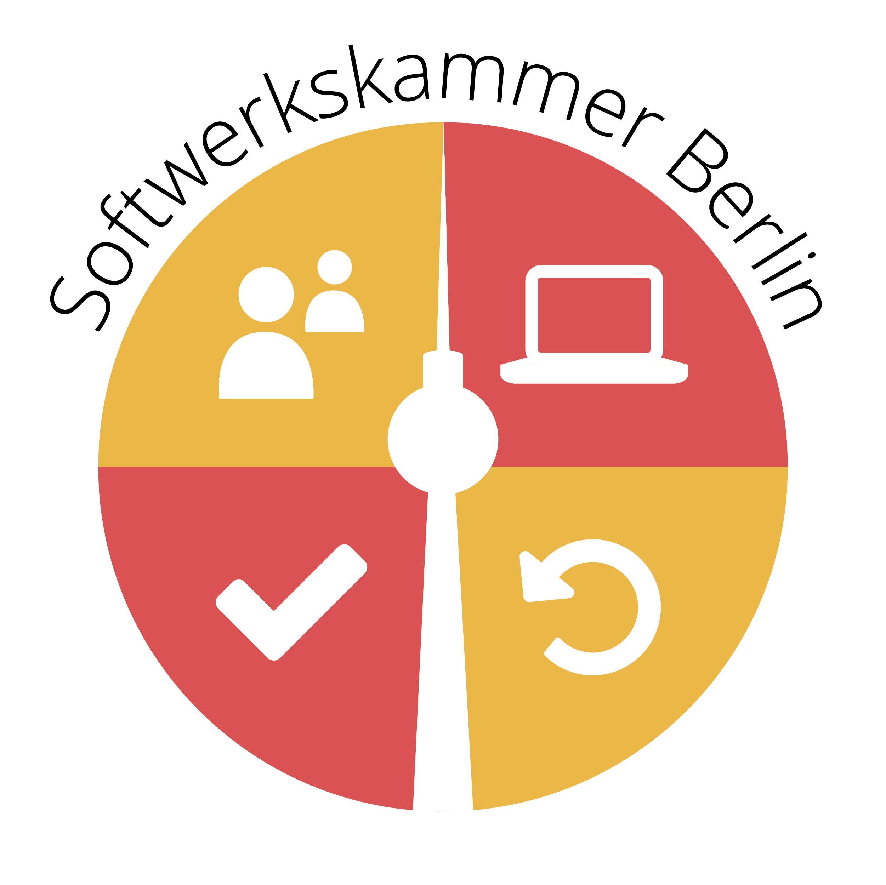

Coderetreat, irgendwer?
=======================

Geht zum Global Day of Coderetreat! Ihr werdet es nicht bereuen.
================================================================

Am 22.10.2016 ist es wieder soweit: Der “[Global Day of Coderetreat](http://globalday.coderetreat.org/)” findet wieder statt. Und ihr fragt euch jetzt sicherlich, was ist eigentlich ein Coderetreat. Denn so häufig hört man davon noch nicht bzw. den meisten Entwicklern, denen ich davon erzähle, haben noch nie nur von dem Wort gehört. Zeit das zu ändern!

Coderetreat
===========

Nur wer trainiert wird irgendwann zum Meister. Das ist eines der Grundprinzipien der “Software Craftmanship” Bewegung – in Deutschland besonders stark durch die [Softwerkskammer](https://www.softwerkskammer.org/) repräsentiert. Der Fokus liegt hier auf den individuellen Fähigkeiten des einzelnen Entwicklers.

Ein Coderetreat ist hierbei ein ganztägige Veranstaltung, die meistens viel zu früh beginnt, bei der man programmiert und sich auf die Grundlagen der Softwareentwicklung, Design und Kommunikation konzentriert. Dabei wir ein Problem immer wieder neu und vor allem anders angegangen.

Hier eine kurze Erklärung (auch hier [von it-agile beschrieben](https://www.it-agile.de/wissen/agiles-engineering/code-retreat/)): Es gibt einen oder mehrere “Facilitators”, also die Veranstalter. Diese erklären und moderieren alles, stellen Fragen, aber greifen nie aktiv ein.

Es gibt 6 Sessions, dazwischen jeweils eine kleine Retrospektive und eine kurze Pause. Eine Session dauert 45min, danach wird der gesamte Code gelöscht, man wird also niemals das Kata fertig bekommen. Am Ende gibt es noch eine größere Diskussion.

Man bearbeitet ein Code Kata, bei uns war es das “Conway’s Game of Life” und jede Session arbeitet man im Paar und darf nicht zwei Mal mit der gleichen Person zusammen arbeiten, also Pair Programming mit wechselnden Pairs.

Oder anders gesagt: Man versucht in 45 Minuten das “Conway’s Game of Life” (oder ein anderes Kata) zu implementieren mit verschiedenen Herangehensweisen, Programmiersprachen und Ansätzen. Und das macht man sechs Mal auf unterschiedliche Art an einem sehr intensiven Tag.

Meistens wird direkt vorgegeben, dass man die Session Test Driven durchführt. Am Ende bzw. bei den letzten beiden Session kommen dann noch oft weitere Einschränkungen (Evil-Pair oder Mob-Programming) dazu bzw. dann wird es einfach noch viel spaßiger.

Ein kleiner Erfahrungsbericht
=============================

Natürlich will ich euch auch gerne an meinen Erfahrungen vom letzten Jahr teilhaben lassen. Der Coderetreat fand in Berlin Mitte bei Nokia Here statt, geleitet wurde er von Martin Klose und organisiert durch die [Softwerkskammer Berlin](https://www.softwerkskammer.org/groups/berlin).

Die Ankunft war um 8.30 Uhr, es gab natürlich insgesamt 6 Sessions.

*   1\. Session: In **JS** mit Karma, mit NPE super schnell aufgesetzt, fetzt!
    *   Hier habe ich gelernt, wie man auch bei JS sehr schnell und einfach Tests an den Start bekommt und wie effektiv es sein kann, wenn einer wirlich der “Driver” und der Partner der “Navigator” ist.
*   2\. Session: **Ruby** mit einer Entwicklerin
    *   Und hier hat sich schnell gezeigt, dass ich nie Fan von Ruby werde.
*   3\. Session: **Java** mit einem Kollegen von der Bild
    *   Total cool, war eine Überraschung hier einen Kollegen von der Bild zu treffen und näher kennenzulernen, ich glaube wir haben ein ganz neues Verständnis füreinander hier aufgebaut.
*   4\. Session: Die erste Session an meinem Mac mit einem Spanier
    *   Hauptproblem war die Sprache, wir haben auf Englisch gesprochen, aber es gab trotzdem sehr große Verständigunsprobleme.
*   5\. Session: **C++**
    *   Mit dem “Ping Pong” Modus, also einer schreibt den Test, der andere die Implementierung und man wechselt sich ab. Ja wirklich, ich hab richtig fett C++ programmiert und dafür Tests geschrieben.
*   6\. Session: **Java** mit Spock als Testframework und der Aufgabenstellung: Keine Control-Statements verwenden.
    *   Weder ich noch mein Partner haben jemals vorher Spock benutzt, aber wir haben es sehr schnell und sehr gut hinbekommen.

Was habe ich gelernt:

*   In der Kurzfassung: Unglaublich viel in sehr kurzer Zeit.
*   Meine Meinung im allgemeinen: Der Fokus liegt auf dem Erlernen von Pair Programming, TDD, besseren Tests, besserer Kommunikation und Verbesserung der Soft Skills. Und das funktioniert an nur einem Tag unglaublich intensiv und effektiv.
*   Man gewinnt viele neue Ansichten, wie Pair Programming richtig gemacht wird und was die Qualität von Software wirklich ausmacht.
*   Ich werde mein Tastaturlayout auf US umstellen – was ich hier bei anderen Entwicklen gesehen habe, hat mich begeistert.
*   Alle Vorurteile über Ruby und Leute die Ruby machen sind wahr.
*   Mit einem guten Kollegen im Pair kann man produktiv in jeder Sprache arbeiten. Wir sind in C++ echt weit gekommen und es hat sehr viel Spaß gemacht, obwohl man bei C++ manchmal den Kopf schüttelt, wie man denn so arbeiten kann.
*   Man lernt sich mehr zu trauen, über seinen Schatten zu springen. Einfach mit fremden Leuten zusammen zu arbeiten in Programmiersprachen von denen man keine Ahnung hat.
*   Not all programmers are created equal.
*   Es gibt immer Programmierer die besser sind als man selbst.

Ein Coderetreat ist meistens an einem Samstag und extrem zeitig (8 Uhr oder 8.30 Uhr) und das hält einige Leute auch von sowas fern. Und das ist auch beabsichtigt. Man trifft auf Entwickler, die bereit sind, etwas dafür zu geben, damit sie besser werden. Die nicht einfach nur von Beruf Programmierer sind, sondern denen ihr Job wichtig ist und der vielleicht auch eine Berufung darstellt. Entwickler, die großartigen Code schreiben wollen. Und bei einem Coderetreat trifft man diese ganzen begeisterten Gleichgesinnten – bei mir waren wahnsinnig viele spannende Menschen da, die ich auch später wieder getroffen habe. Und ein abschließendes Wort: Nach einem Coderetreat ist man definitiv ein besserer Programmierer.

Hier noch ein paar Links:

*   https://medium.com/@egga_de/what-to-expect-from-a-code-retreat-aef6310c1292
*   https://www.holisticon.de/2015/11/hamburgs-global-day-of-code-retreat-bei-holisticon