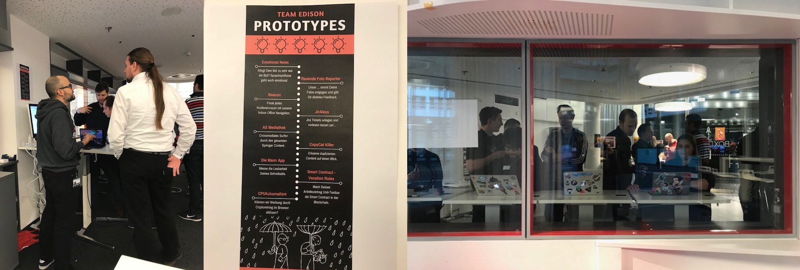
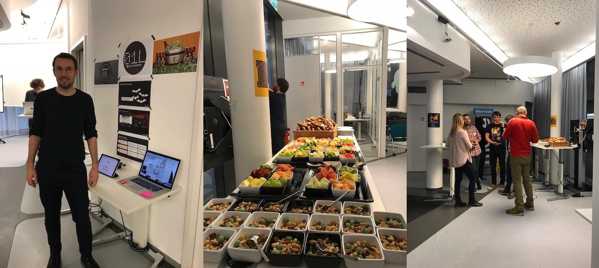

# Ideas Engineering präsentiert die IPA
Alle zwei bis vier Wochen finden wir uns gemeinsam ein um uns die Geschichte darüber zu erzählen was wir in den vergangenen zwei Wochen gemacht haben. So steht es in der Scrum Bibel. Jedes Team bereitet sich auf diese Zeremonie ausführlich vor, unsere Zuhörer sind aber zumeist aus den eigenen Kreisen.

Im Projektkontext kommen unsere Stakeholder gerne zu den von uns vorgeschlagenen Terminen, um die für sie erarbeiteten Ergebnisse zu betrachten, zu bewerten und schlussendlich, zumindest so in der Theorie, abzusegnen. Was aber wenn sich außer den internen, eigenen Stakeholdern niemand zum Review zeigt? Was wenn das häufiger der Fall ist und man sich nun fragen muss - wie bekomme ich ein größeres Publikum für das Review zusammen? Wie können wir lernen, wie können wir besser werden, wenn die Diskussion stets dieselbe bleibt?
Die Antwort auf die letzte Frage lautet: Gar nicht!

## Das Experiment
Ideas Engineering hat ein Experiment gewagt. Wir gehen raus aus den eigenen vier Wänden. Wir haben die Diskussion nach Außen verlagert. Alle 3 Monate organisieren wir bzw. unser Agile Coach Marco Böttcher die Ideas Produkt/Projekt/Prototypen Ausstellung. Was geschieht bei diesem Format mit dem wir gerade experimentieren?

Alle Teams, Product Owner, wie auch Developer finden sich ein und bereiten sich gemeinsam auf diesen Termin vor. Wir wählen die Themen aus, die wir vorstellen wollen, setzen die Projekte/Produkte/Prototypen so auf, dass wir sie vorführen können. Das Ziel unserer IPA ist es das Ideas Engineering Portfolio einem breiteren Publikum vorzustellen. Dabei soll der Besucher unserer Ausstellung von Stand zu Stand laufen können und sich die Arbeit der Teams zeigen lassen.

Anders als beim Sprint Review erfahren die Besucher alles über die Produkte und nicht nur den Verlauf, bzw. das Commitment der letzten zwei Wochen. Für die Neugierigen haben wir Marketingmaterial zur Verfügung, ähnlich wie auf einer klassischen Messe. Häufig möchte man sich im Nachgang noch einen tieferen Einblick verschaffen und kann sich aber weder an die Ansprechpartner, noch an die Namen der Produkte erinnern. Diese Lücke wird von dem Marketingmaterial geschlossen.
Lessons Learned
Die IPA hat Stand heute schon 3 Mal stattgefunden. Jedes Mal bekommen wir mehr Besucher auf unseren Ständen. Jedes Mal erhalten wir wichtiges Feedback von Außen. Was haben wir aus der IPA gelernt?

Als Ideas Engineering haben wir nicht genug Reichweite im Konzern. Unsere Produkte sind zum Großteil unbekannt.
Trotz der fehlenden Reichweite machen wir die richtigen Dinge. Auf der IPA haben wir viel Bestätigung zu unseren Produkten, Projekten und unseren Prototypen erhalten.

### Wir gehen in die Verlängerung...stay tuned und besucht uns bei der nächsten IPA...

 
