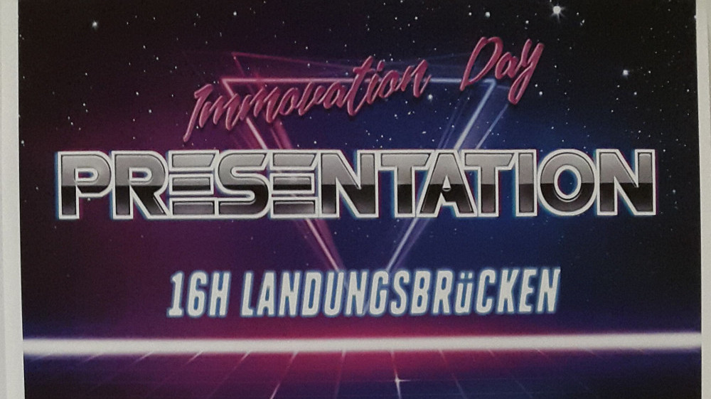
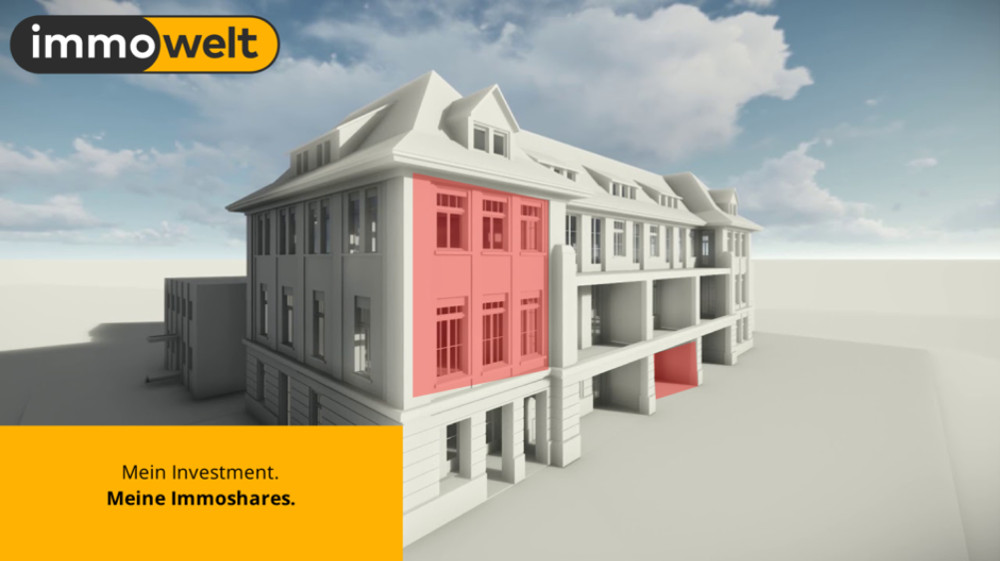
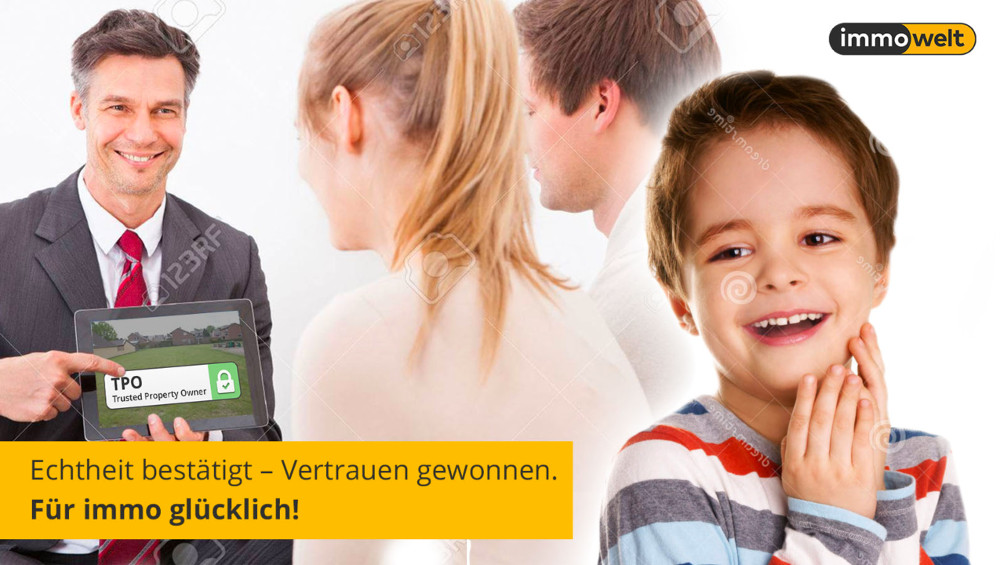
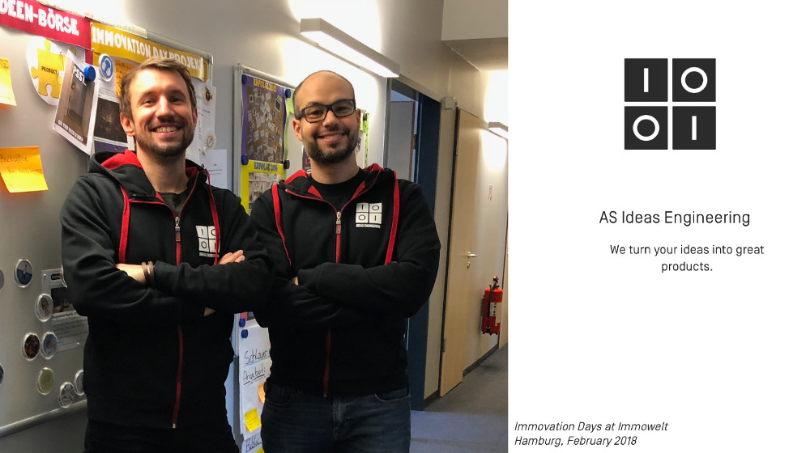

# Immovation Days bei Immowelt in Hamburg

Dies ist eine Geschichte über Hamburg, Blockchain, Pizza, Bewegungssensoren und Trüffel. 

Beginnen wir bei Immowelt in Hamburg. Immowelt veranstaltet in regelmäßigen Abständen den “Immovation Day”, einen Tag an dem die Entwickler die Freiheit bekommen, an Projekten zu arbeiten, die sie sich selbst überlegen und ohne Vorgaben umsetzen. Die einzigen Regeln sind, dass das Projekt der Firma zugute kommt und dass nach 24h ein Ergebnis präsentiert wird. Alles andere wird den Entwicklern überlassen. Dieses Konzept ist weit verbreitet: https://www.scrum.org/resources/fedex-day-lighting-corporate-passion.

Der jüngste Immovation Day war ein ganz besonderer, denn Immowelt lud die Blockchain Spezialisten der AS Ideas ein mitzumachen sodass die Entwickler von Immonet Einblick in die Welt der Blockchains gewinnen können. Letztendlich kann auch die Immobilienbranche von Blockchain Use-Cases profitieren. Wir hatten im Januar eine hohe Sichtbarkeit in Bezug auf Blockchain-Technologien gewonnen, nachdem wir mehrere Blockchain Prototypen bauten und Vorträge für Entwickler und Nicht-Entwickler zu dem Thema hielten. Das sprach sich auch bis nach Hamburg rum und so hatten wir die Ehre, zum Blockchain-Immovation-Day eingeladen zu werden. 

Waschi und ich nahmen die Herausforderung gerne an und repräsentierten die AS Ideas bei dem Event. Neben uns waren auch Entwickler von Immowelt aus Nürnberg und von Verimi aus Berlin dabei. Eine Premiere war die Verlängerung des Immovation Days auf 2 Tage um alle Projekte gut organisieren zu können und genügend Freiraum für unbekannte Themen wie Blockchain-Entwicklung zu geben. 

Nach unserer Ankunft wurden wir sehr herzlich empfangen und bekamen eine Führung durch die Räumlichkeiten und ganz wichtig: heißen Kaffee. Gleich zu Beginn des Events wurde klar, dass es riesig werden würde, denn alleine die zügige Vorstellung aller Projektideen in dem gut gefüllten Großraumbüro dauerte schon deutlich länger als gedacht. Eine größere Gruppe von uns war heiß auf Blockchains und erklärten Konferenzraum “Elphi” zu unserem Blockchain Hauptquartier. Hier gingen wir die Basics von Blockchain und Smart Contracts durch und Waschi und ich gaben einen kurzen Einblick in die Blockchain Prototypen, die wir in Berlin bereits gebaut hatten. 

##   

Damit wir uns nicht gegenseitig auf die Füße treten, teilten wir uns in 2 Gruppen auf und überlegten uns 2 epische Blockchain Produkte für die Welt der Immobilien. Wir implementierten Smart Contracts in Solidity und deployten sie in einer privaten Ethereum Chain. Waschi und ich brachten zwar ein wenig Vorwissen zu Blockchains mit aber mit einem so großen Projektteam in zwei Tagen zwei Blockchain Projekte an den Start zu bringen war auch für uns eine Premiere. 

Debugging in Solidity kann schnell recht umständlich werden, weshalb sich anbot gleich von Anfang an testgetrieben zu arbeiten. Während der Entwicklung nutzen wir Truffle für das Deployment und Ganache um schnell und unkompliziert unsere Smart Contracts in einer virtuellen Blockchain auszurollen und zu testen. Ganache basiert auf TestRPC, einem Ethereum Client, der die Ausführung von Smart Contracts simuliert und es einem erspart einen echten Ethereum Knoten zum Testen und Debuggen zu betreiben. 

Am Abend des ersten Tages gab es eine von Immowelt gesponsorte Pizza Party und ein gemeinsames Ausklingen des Tages bis die Reinigungskräfte verzweifelt versuchten, um uns herumzuputzen und wir entschieden, das Büro zu verlassen und im Hotel weiterzuhacken. 

<iframe src="https://docs.google.com/presentation/d/e/2PACX-1vRVPgIhfbyIq_KGTng38B3xP1Ld38xJ7SVsEnB-QM7FZLRgA1iaTsCt1JJaA1O5l0W7LaFd7MxW72yJ/embed?start=false&loop=false&delayms=3000" frameborder="0" width="400" height="254" allowfullscreen="true" mozallowfullscreen="true" webkitallowfullscreen="true"></iframe>
<iframe src="https://docs.google.com/presentation/d/e/2PACX-1vT47bd4Houz4X4MQSp1zTPpcHW9ipOGpfaGSYeM-dSwWzTbWd_9_raZpDm36qGg0XVOcn31rkWZ-c_5/embed?start=false&loop=false&delayms=3000" frameborder="0" width="400" height="254" allowfullscreen="true" mozallowfullscreen="true" webkitallowfullscreen="true"></iframe>

Der zweite Tag verging wie im Fluge und das Abschlussevent um 16:00 kam viel schneller als gewünscht. Es gab noch so viele Features die wir unbedingt in unsere Projekte einbauen wollten aber auch dieses Event musste irgendwann zu Ende gehen. Wir präsentierten gemeinsam unsere Ergebnisse und es waren echt spannende Themen dabei. Unangefochtene Sieger des Events waren natürlich die fantastischen Blockchain Projekte, die Immowelt ein vielversprechendes neues Geschäftsfeld eröffneten. Das ist natürlich nur meine persönliche Meinung und als Blockchain Entwickler bin ich eventuell ein wenig voreingenommen. Aber es gab auch viele Blockchain-freie Projekte, die beeindruckten. Eine Augmented-Reality-App für das Smartphone nimmt das Foto eines Grundriss' und transformiert es in ein 3 dimensionales Modell, das auf dem Screen in den Raum projiziert wird und aus allen Blickwinkeln betrachtet und sogar mit Möbeln bestückt werden kann. Ein Team baute eine automatische Fraud-Detection, basierend auf dem AWS Machine Learning Framework. Für einen Überblick über die Verteilung von Immobilienpreisen wurde über die Google Maps API eine Karte mit aktuellen Preisen farblich codiert und als Layer angezeigt. Und natürlich durfte das wertvollste Werkzeug nicht fehlen: Ein Bewegungssensor am Kicker signaisiert einem Webserver, ob der Kicker belegt ist oder nicht. Kudos!

Vielen Dank nochmal an Immowelt Hamburg für die Einladung und den tollen Immovation Day!

