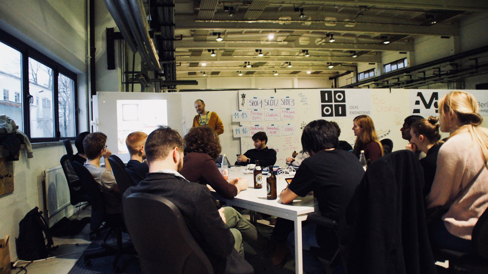
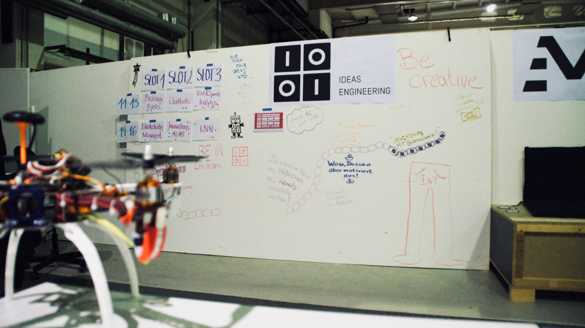
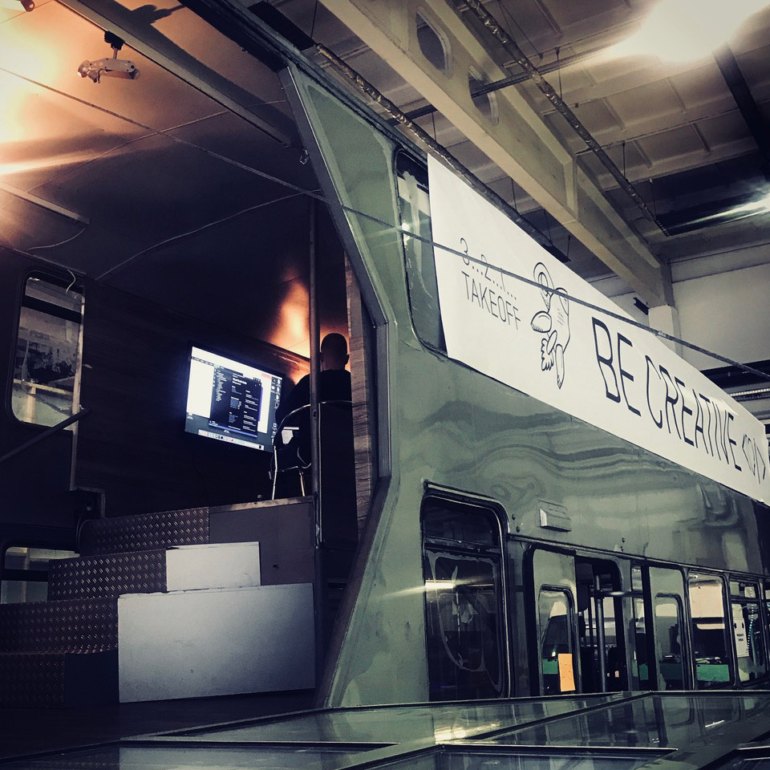
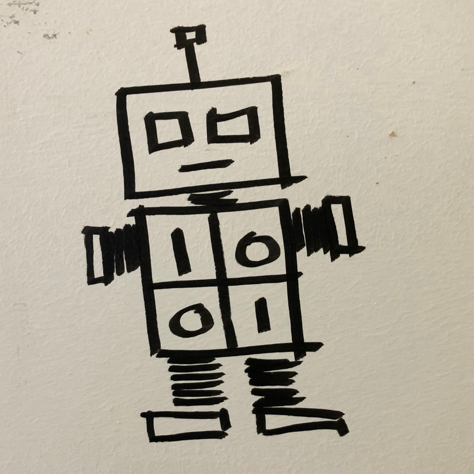
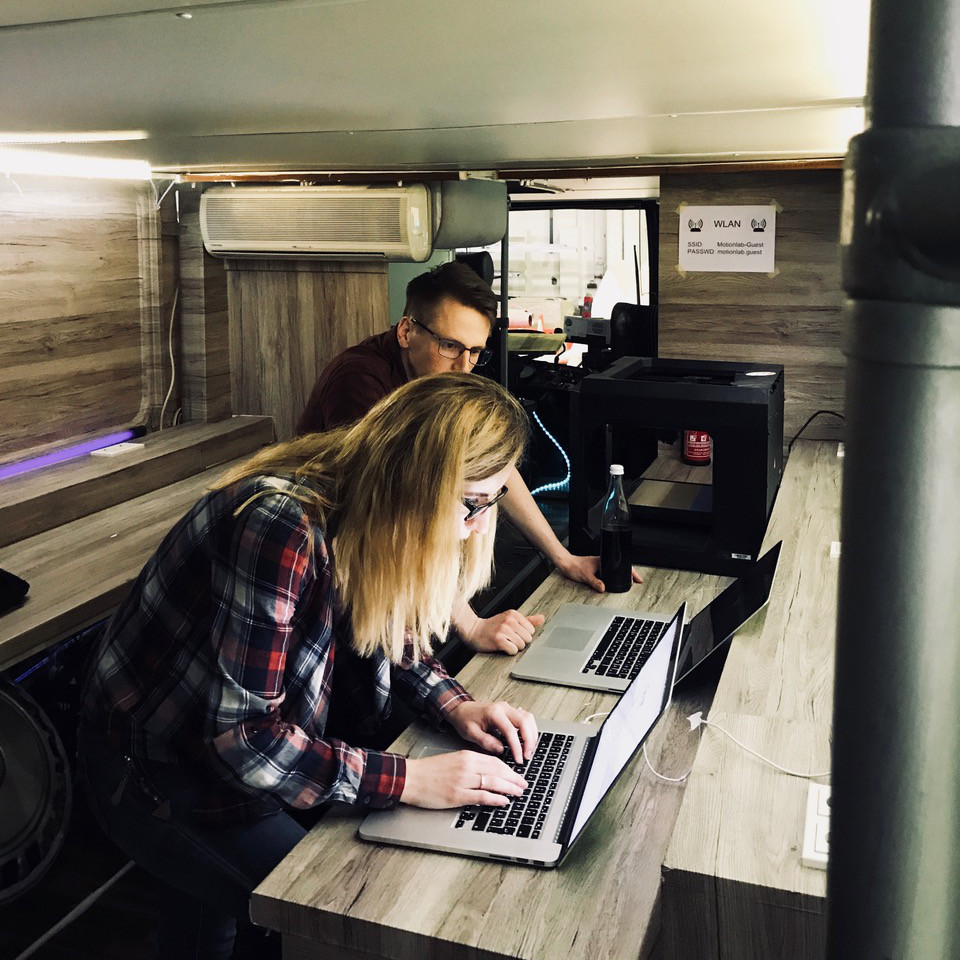
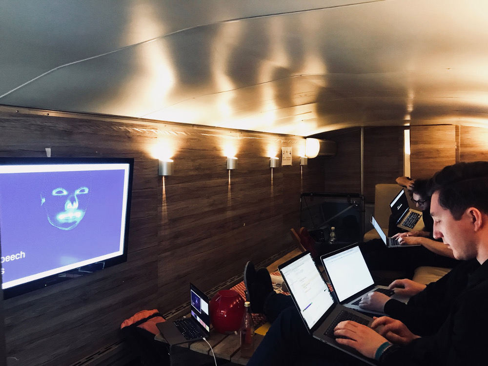
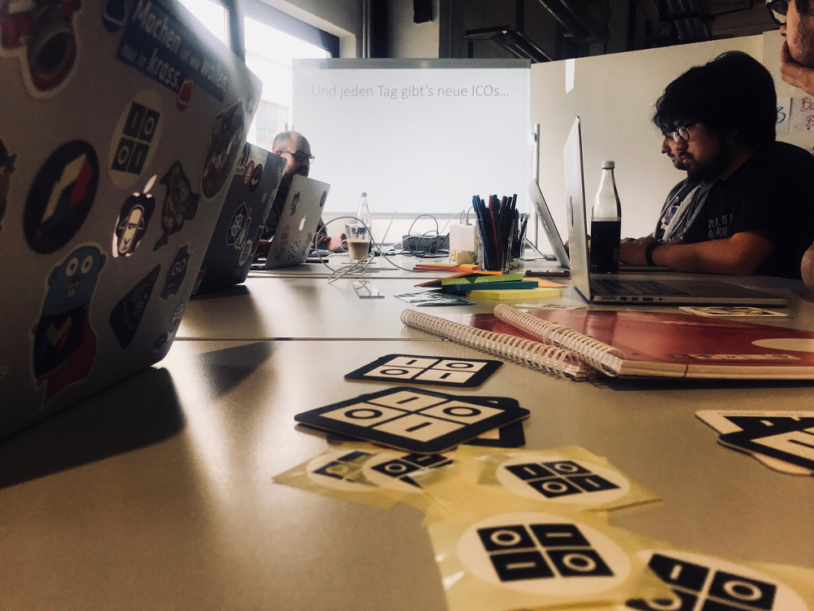
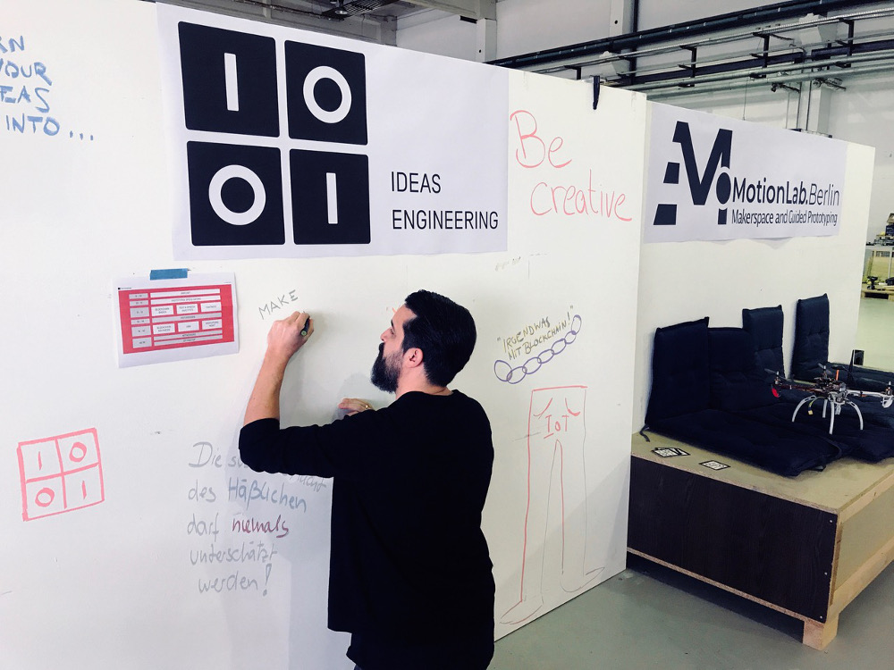
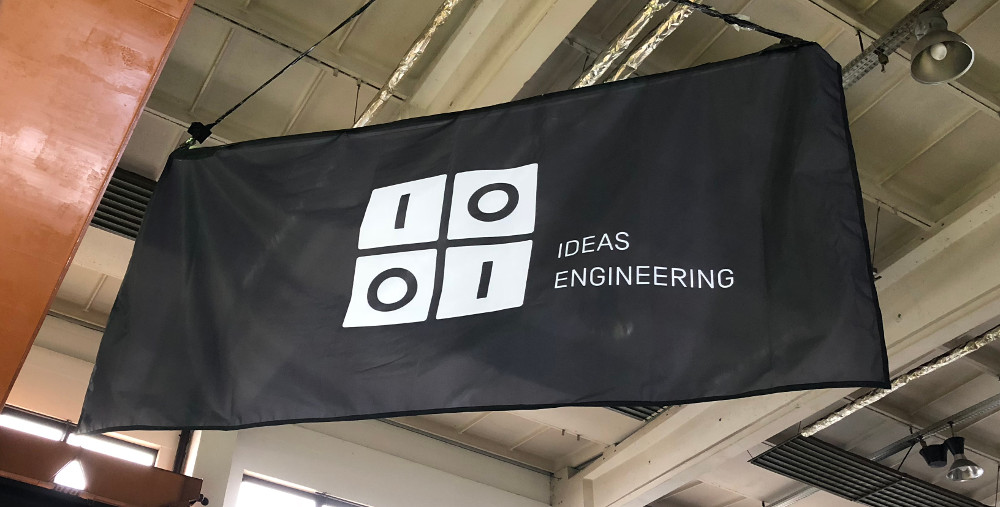
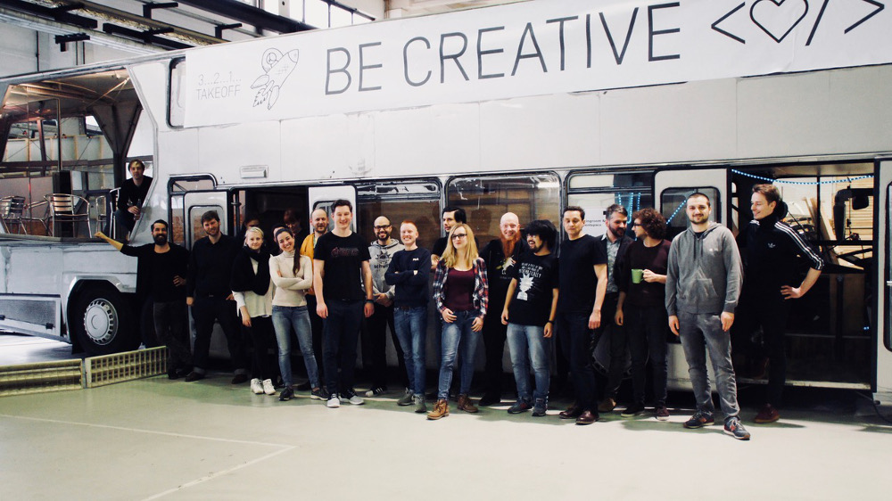

# Knowledge-Transfer-Offsite im MotionLab Berlin

Bei AS Ideas generieren wir kontinuierlich Ideen, Prototypen und Wissen. Erfolgskritisch ist dabei, dass wir unsere Initiativen reflektieren und das gewonnene Wissen untereinander teilen. Für einen freien Kopf und frische kreative Energie zogen wir uns diesen März ins Offsite zurück, also raus aus dem eigenen Büro und rein in eine unbekannte, unorthodoxe Umgebung. Martin, unser Product Owner für Innovation, organisierte uns hierfür das [MotionLab Berlin](https://motionlab.berlin/). In einer großen Halle auf einem Industriegelände in Berlin Treptow-Köpenick standen uns hier Räumlichkeiten zur Verfügung, die nicht wirklich "Räumlichkeiten" sind. Zwischen kubikmetergroßen 3D Druckern, Lastenfahrrädern und einem zum Konferenzraum umgebauten Bus organisierten wir unsere Sessions, die wir dann je nach Gruppengröße in den kleineren oder größeren Bereichen hielten.

In den letzten 6 Monaten entwickelten wir insgesamt 19 Prototypen und viele neue Erkenntnisse. Dieses Offsite war das erste, das wir in dieser Art organisierten und so war die erste Herausforderung einen Modus zu finden, in dem wir möglichst viel Wissen streuen und gleichzeitig einen Fokus auf die relevantesten Themen legen können. Wir entschieden uns für 6 Session zu je 2h, die wir in 3 Tracks aufteilten. Unsere Themen waren
* Blockchain Basics
* Blockchain Advanced
* Text & Speech Analysis
* Chatbots
* Lazy Learning per KNN
* Innovationsmanagement

### Prototype Speed Dating

Nach dem obligatorischen Willkommenskaffee und einer Führung durch die Büros und Werkstätten des MotionLabs starteten wir die Veranstaltung mit einem "Speed Dating" aller 19 Prototypen. Martin, Tom und ich (Team Edison) gaben uns jeweils 2 Minuten pro Prototyp um das jeweilige Thema zu rekapitulieren, und das Ergebnis in Erinnerung zu rufen. Damit war dann auch der Startschuss für das Event gegeben sodass wir uns auf die Sessions stürzen konnten. 

### "Irgendwas mit Blockchain"

Der größte unserer Themenkomplexe war Blockchain. Wir hatten den Januar zum "Blockchain Monat" erklärt und mehrere Prototypen für Smart Contracts geschrieben. Wegen der etwas höheren Komplexität teilten wir das Thema in die Sessions "Basic" und "Advanced" ein. Alle Teilnehmer der Blockchain Basic Session brachten ein wenig theoretisches Grundwissen in Blockchains mit aber Detailfragen wie "Was genau ist eigentlich Mining?" waren offen. Wir diskutierten über die Unterschiede zwischen Bitcoin und Ethereum, über Hashing, Mining und den Konsensmechanismus, über ICOs, über völlig irre Coins, die täglich veröffentlicht werden und über Anwendungsfälle von Smart Contracts. Um live einen echten Contract schreiben zu können, bauten wir dann gemeinsam ein "Hello World" in Solidity für Ethereum. Für einen schnellen Start bereiteten wir die nötigen Tools in Docker vor, sodass die Teilnehmer sofort loslegen konnten.

Die Blockchain-Advanced-Session drang tiefer in die Welt von Solidity ein und wir klärten Details über primitive und komplexe Datentypen, Arrays und Mappings, Addressen und Kontrollflüsse. Die Ethereum Virtual Machine arbeitet etwas anders als klassische Ausführungsumgebungen, da Ausführung von Programmcode sehr teuer ist und daher jede Zeile Code mit großer Sorgfalt gestaltet werden muss. Für die Ausführung eines Smart Contracts müssen konkrete Kosten definiert werden, was für viele Fragezeichen sorgt. Eine wichtige Erkenntnis aus der fortgeschrittenen Entwicklung in Solidity ist, dass die Auswahl dieser Technologie mit großer Vorsicht geschehen muss, da abhängig vom Use-Case, der Entwickler sich das Leben eventuell mit Ethereum unnötig schwer macht.

##   

### Chatbots

Im dritten Track starteten wir mit Chatbots, einem Thema das gerade in den letzten Jahren einen mächtigen Aufschwung bekommen hat, weil die großen Softwarehäuser (insb. IBM, Microsoft und Amazon) Lösungen mit hoher Leistung und einfachem Einstieg bieten. Bei AS Ideas setzten wir bereits Chatbots von Google's Dialogflow Engine, von AWS Alexa und von IBM Watson ein. In dieser Session sollte allen Teilnehmern das Grundkonzept eines Bots näher gebracht und gezeigt werden, wie Natural Language Processing (NLP) mit definierten Intents und angebundenen Actions zusammenarbeitet. Auf Veranstaltungen auf denen wir Chatbots präsentieren, begenen wir häufig viel Skepsis vor Bots, die natürliche menschliche Dialoge beherrschen. Tatsächlich eröffnen sich durch diese Art von virtueller Assistenz aber sehr viele Einsatzmöglichkeiten. Der beeindruckendste Chatbot, den wir bisher bauten, ist ein Analysebot, dem man im Facebook-Chat ein Foto übergeben kann und mit dem man dann über das Motiv, Farbe, Hintergrund, Auflösung etc. diskutieren kann. Der Bot erkennt automatisch die Inhalte des Bildes und entscheidet eigenständig, ob das Bild für eine Fotokampagne thematisch und qualitativ akzeptiert werden kann oder nicht. Im natürlichsprachlichen Dialog gibt er dem User direktes Feedback und beantwortet Fragen. Gerade bei tausenden Fotoeinsendungen kann dieser Bot sehr viel Arbeit ersparen. 

##   

### Text & Speech Analysis

Ein weiteres spannendes Thema ist die Sprachsynthese. Alexa, Siri und Google Home plappern ja schon seit einer Weile recht überzeugend mit uns und sind heute bereits Teil unseres Alltags. Die Thesen, die wir bei AS Ideas untersuchten, waren ob wir über die Speech Synthesis Markup Language (SSML) einem Bot Emotionalität in seiner Aussprache mitgeben können und ob wir vollautomatisch einen Live-Vortrag per Spracherkennung untertiteln können. Beides haben wir tatsächlich prototypisch geschafft und freuten uns sehr darauf, unsere Erkenntnisse mit den Teilnehmern zu teilen. Die Session war etwas holprig, da die APIs und die Frameworks nicht so richtig wollten wie sie sollten aber dennoch konnten alle einen Einblick in die Thematik gewinnen und verstehen, was der heutige Stand der Technik leisten kann.  

### Lazy Learning per KNN

Das Jahr 2018 steht ganz im Namen von Artificial Intelligence (AI) und so haben wir uns auch an diese Materie gewagt. Wir bauten jüngst einen Prototypen für ein System, das für einen Nachrichtenartikel eine Liste der "ähnlichsten" bekannten Artikel zusammenstellt. Hierfür setzten wir den K-Nearest-Neighbor Algorithmus ein, der zur Kategorie des Lazy Learnings gehört. Lazy Learning bedeutet in diesem Fall, dass das System mit dem Hinzufügen eines neuen Artikels "lernt" und eine angepasste Ergebnisliste zurückliefert. Die Berechnung geschieht erst zur Anfragezeit (daher 'lazy'), und verwendet die Trainingsdaten als Modell ohne ein separates Modell vorzuberechnen. Diese Session war die mathematischste unserer Sessions, da die zentrale Herausforderung von KNN die Auswahl des Entfernungsmaßes ist über das die relative Nähe von Elementen zueinander berechnet wird. Wir diskutierten die Euklidische Distanz, die Manhattan Distanz, die Kosinus Distanz und den Pearson Korrelationskoeffizienten. Zum besseren Verständnis spielten wir die Berechnung der Distanzen anhand von Beispielen durch und implementierten dann eine Ähnlichkeitsanalyse von Nachrichtenartikeln in Python. Die Session wurde ein wenig ausgebremst nachdem der wunderbar vorbereitete Docker Container mit unseren Tools sich nicht aus dem Repo runterladen lies weil die Internetleitung zu dünn war. Nachdem wir die Werkzeuge von Hand auf den Rechnern nachgerüstet hatten, ging es weiter.

### Innovation Management

Wir sind bei AS Ideas besonders stolz auf unseren Innovationsprozess. Wir sammeln Ideen und Pitches von jedem Ideas Mitarbeiter (und auch Externen, die uns ihre Ideen mitgeben) und verfeinern sie in unserem Innovation Funnel bis zu einem fertigen Prototypen. In der Innovation Management Session diskutierten wir Ideen, wie wir diesen Prozess noch verbessern könnten und was uns eventuell noch fehlt. 

Das Feedback zu diesem Event war insgesamt sehr positiv wobei wir gleichzeitig für das nächste Mal auch noch viel Verbesserungspotential gefunden haben. 

