How to become a better developer (without coding) #1
====================================================

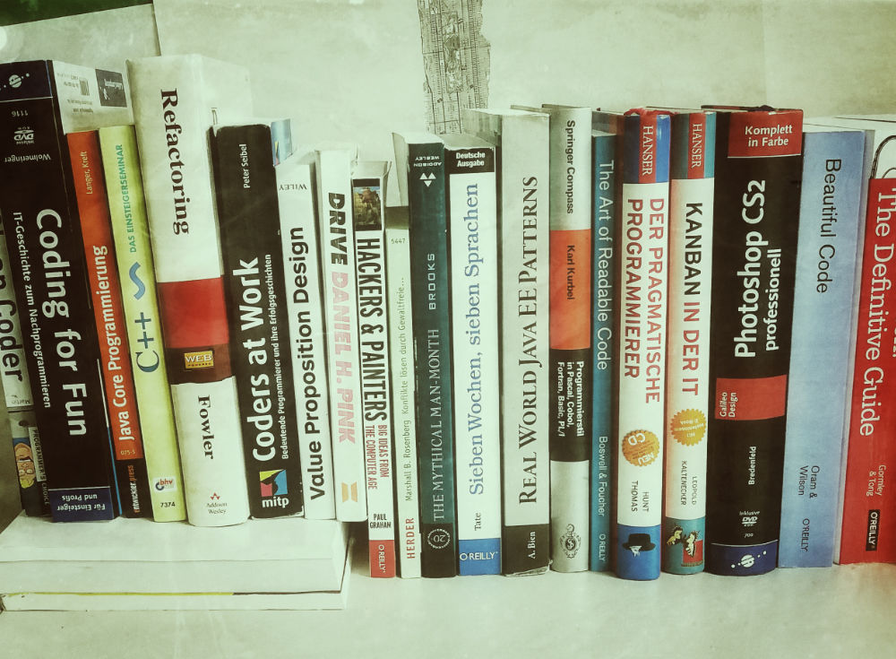

You want to become a better developer without more coding? You should read some books! Like forever ago I gave a talk about 15 books in 15 minutes. These books will help you (and helped me) to become better at what you love most: Developing software.

They are must read books for developers. Yes, you will become a better developer by reading them. I even dare to say that at some point you will not become better by only practicing or learning new programming languages. But by reading books about our profession or even about the business and psychology.

# #1 The Pragmatic Programmer
# 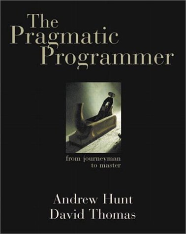

This one is a classic. It's actually a tie with number two! There are always 10 kinds of people: The Clean Code fans and the Pragmatic Programmers. At my first job we had both and we always discussed these two books. They both adress the basic problem every new developer has: What makes good code? But they have a different approach of teaching you.

The Pragmatic Programmer is the one book you should read as a new member of our profession. It tells you anything you need to know about what makes code good. Or what makes bad code. It even gives you a set of rules to follow! It's quite direct with instructions on what to do and what not to do.

My friend Torsten Ehrhorn even wrote a [Jenkins Plugin](https://wiki.jenkins.io/display/JENKINS/Pragprog+Plugin) which gives you quotes and tipps directly out of the book.

# #2 Clean Code
# 

The competitor of the number one spot. Everything I said abouve is also true for Clean Code. I dare to say that the cult about this book is even bigger.

What's the difference to The Pragmatic Programmer? It's the style of teaching: More like anecdotes and little bit more Zen. It tries to give you a understanding why something is good and why something is bad.

# #3 Effective Java
# 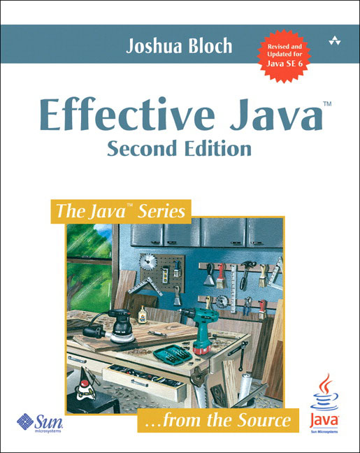

It's written by one of the core developers of the Java library, Joshua Bloch. You don't like Java? You still need to read this book! It tells you a lot about the design of software. And the JDK is not any software, it's huge! Reading this book also teaches you about good code, about design decisions and about the thoughts which flow into the Java core API.

# #4 Java Puzzlers
# 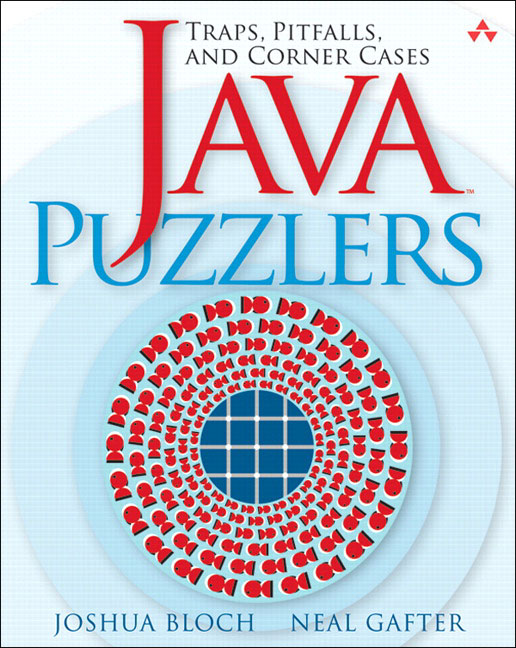

OK, you can skip this book if you are not a Java developer. It's also from Joshua Bloch. At my first company someone got his hand on this book. And then we good a daily challenge out of it by mail. We loved it! It teaches you so much about Java and some quirky parts of it. Here is an example:

# 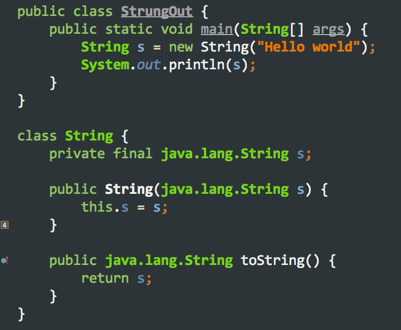

# #5 Head First Design Patterns
# 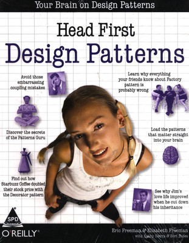

The legendary Gang of Four book (GoF) about Design Patterns. A must read everybody recommends! Don't read it. It's boring as hell. Read this one instead.

The examples are in C#, but it has a great layout and explains the different patterns way better.

# #6 Coders At Work
# 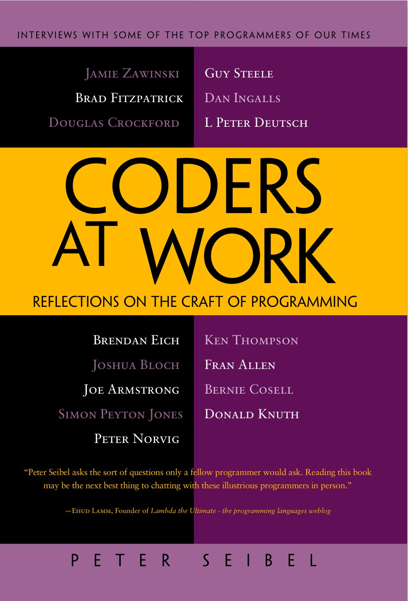

This book opened my eyes. Before reading this book I thought I knew what makes a great developer. What's right and what is wrong. But after Coders At Work I realised how wrong I was. How single minded. These people are the most renowned ones of our profession. They have an enourmes track record.

And they say totally different things. Like opposite approaches to solving the same problem. You can read one chapter and let the wise words think in. And then the next one with another developer interviewed who says the opposite and it's also wise and true!

Here is the list of the interviews:

* Frances Allen: Pioneer in optimizing compilers, first woman to win the Turing Award (2006) and first female IBM fellow
* Joe Armstrong: Inventor of Erlang
* Joshua Bloch: Author of the Java collections framework, now at Google
* Bernie Cosell: One of the main software guys behind the original ARPANET IMPs and a master debugger
* Douglas Crockford: JSON founder, JavaScript architect at Yahoo!
* L. Peter Deutsch: Author of Ghostscript, implementer of Smalltalk-80 at Xerox PARC and Lisp 1.5 on PDP-1
* Brendan Eich: Inventor of JavaScript, CTO of the Mozilla Corporation
* Brad Fitzpatrick: Writer of LiveJournal, OpenID, memcached, and Perlbal
* Dan Ingalls: Smalltalk implementor and designer
* Simon Peyton Jones: Coinventor of Haskell and lead designer of Glasgow Haskell Compiler
* Donald Knuth: Author of The Art of Computer Programming and creator of TeX
* Peter Norvig: Director of Research at Google and author of the standard text on AI
* Guy Steele: Coinventor of Scheme and part of the Common Lisp Gang of Five, currently working on Fortress
* Ken Thompson: Inventor of UNIX
* Jamie Zawinski: Author of XEmacs and early Netscape/Mozilla hacker

# #7 Seven Languages in Seven Weeks
# 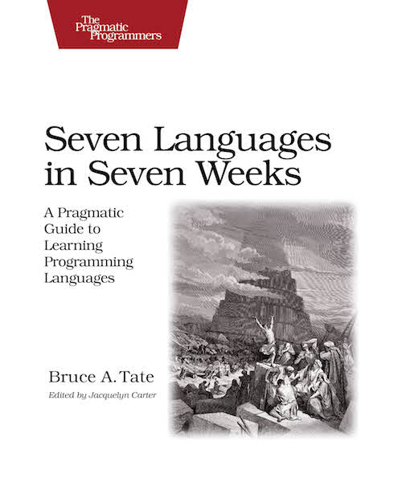

OK, you will need to do some coding for this book. At some point to become better you will need to widen your horizon as a developer. Up until this book I had only written code in C/C++, Assembler, Matlab, C# and Java. But this book opened my eyes. I learned a lot from knowing more concepts from other languages. I even got a kind of feeling when something feels strange or odd. Oh boy, what a ride it was with these 7 languages.

* Ruby
* Io
* Prolog
* Scala
* Erlang
* Clojure
* Haskell

# #8 Effective JavaScript</h2>
# 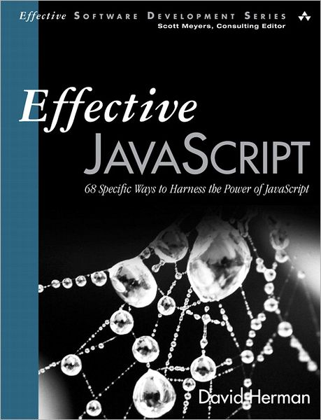

You don't like JavaScript? Well, try to get used to it. The web runs on JavaScript. This book is a nice example of a good book about JS. There are a lot of other books to recommend, like "JavaScript: The Good Parts".

# #9 The Phoenix Project
# 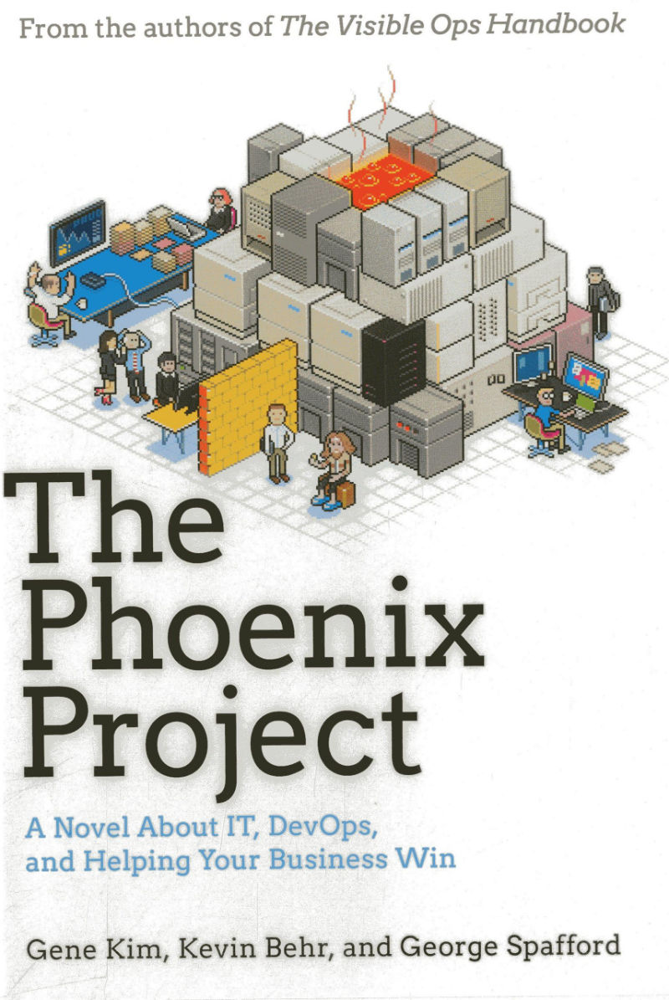

Another book about DevOps: The Phoenix Project. But totally different than any other book on this list. This is a novel! This book made so much fun and I had a rollercoaster of emotions while reading it. It's quite short and an easy read. For some people this book may change their view on a lot of things. And how to work.

It's about an ops team lead, who becomes VP of Operations in the beginnging and how he and his organisation are struggeling. An awesome novel for the holidays!

# #10 The Art of Readable Code
# 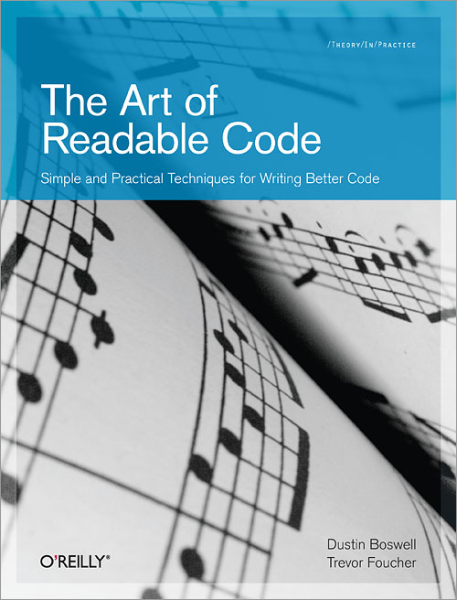

There are only two hard things in Computer Science: cache invalidation and naming things. (Phil Karlton)

And this book is, as the title tells you, mostly about naming things and how to structure your code to make it readable. The topic is touched in Clean Code and The Pragmatic Programmer, but here is another whole book about it.

# #11 The Mythical Man-Month (1975)
# 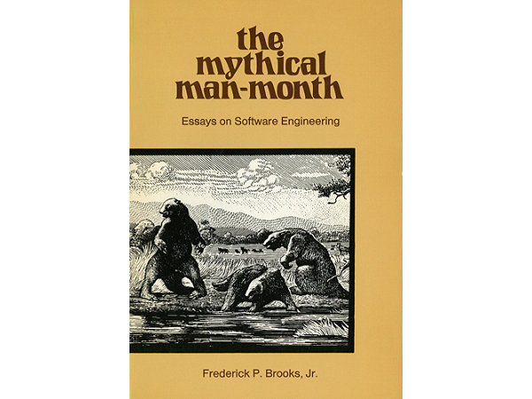

> "The Bible of Software Engineering"

To make it short: This book is older than most of the people reading this sentence. And everthing in this book is still true today. This book is like a treasure of advice. Every person how is kind of a manager or who is involved in IT projects must read this book.

> "everybody quotes it, some people read it, and a few people go by it"

There is a tendency in the field of IT to just repeat the managment errors of the past. This book is the cure.

> “He also made the mistake of asserting that one project — writing an ALGOL compiler — would require six months, regardless of the number of workers involved (it required longer).”

There is a huge list of topics or ideas in this book, just look at the table of contents. Here are some of the chapters: No silver bullet, The second-system effect, Project estimation, Communication, Lowering software development costs

# #12 Drive: The Surprising Truth About What Motivates Us
# 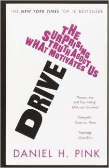

The first book in this list, which is not directly about software development. It still helped me in huge ways in understanding why people act how the act and what we can do about it. It was my first step in the direction of not only trying to be better at the building the solution, but understanding problems.

The three central pieces for intrinsical motivation are: Autonomy, Mastery and Purpose.

# #13: Building Microservices
# 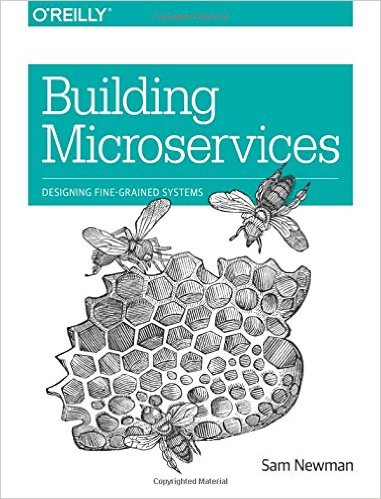

All people talk about microservices, few people understand it, less people get it right. I could write a whole article only about this topic. But maybe you need to read this book first, before we can talk.

# #14 Release It!
# 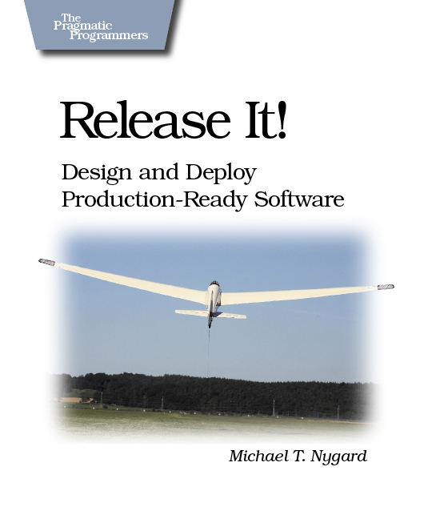

This book is from 2007, but it got new hype with the DevOps movement. When you read it, you won't believe it's that old. And you will be more paranoid after reading the book, in a positive way. It's full of war stories and things that can (and will) go wrong.

# #15 The Five Dysfunctions of a team  
# 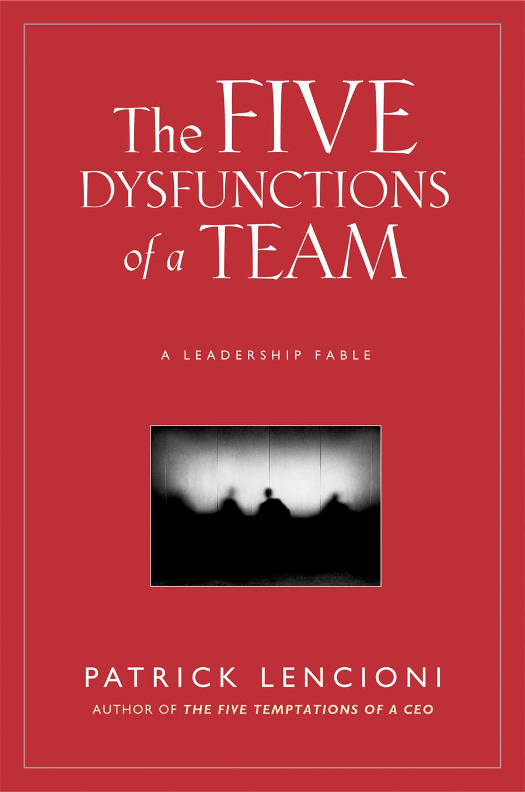

The second book more about psychology. It's quite a ride and also more of a novel. You can read it quite easily, it is short and well written.

# 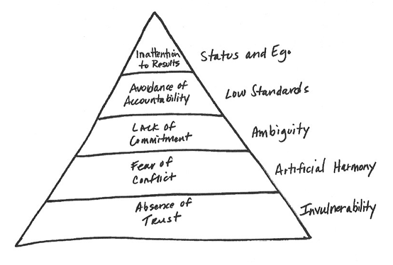

# Bonus: Extraleben Trilogie (only in german)
# 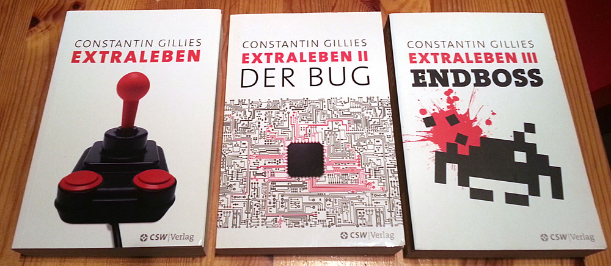

A bonus included to give you some slack after that many (more or less) intense books. And I count this one as one book, even if it is a trilogy. It's a pity that it was only published in german. A novel about two guys working in IT who love old videogames and find a conspiracy hidden in a retro game.

You won't become a better developer by reading it, but if you love IT and old videogames, there books are brilliant.

## Last but not least

I now have a new list #2 with books, so I needed to write down the old list. This was number one of a two part post. Because at some point you won't become better by [Katas](http://codekata.com/), [Code Retreats](http://codekata.com/) and [training](https://www.udemy.com). You will need to broaden your horizont and develop a better understanding of the problem, not of the solution. These books from list #1 only help you at understanding the solution.