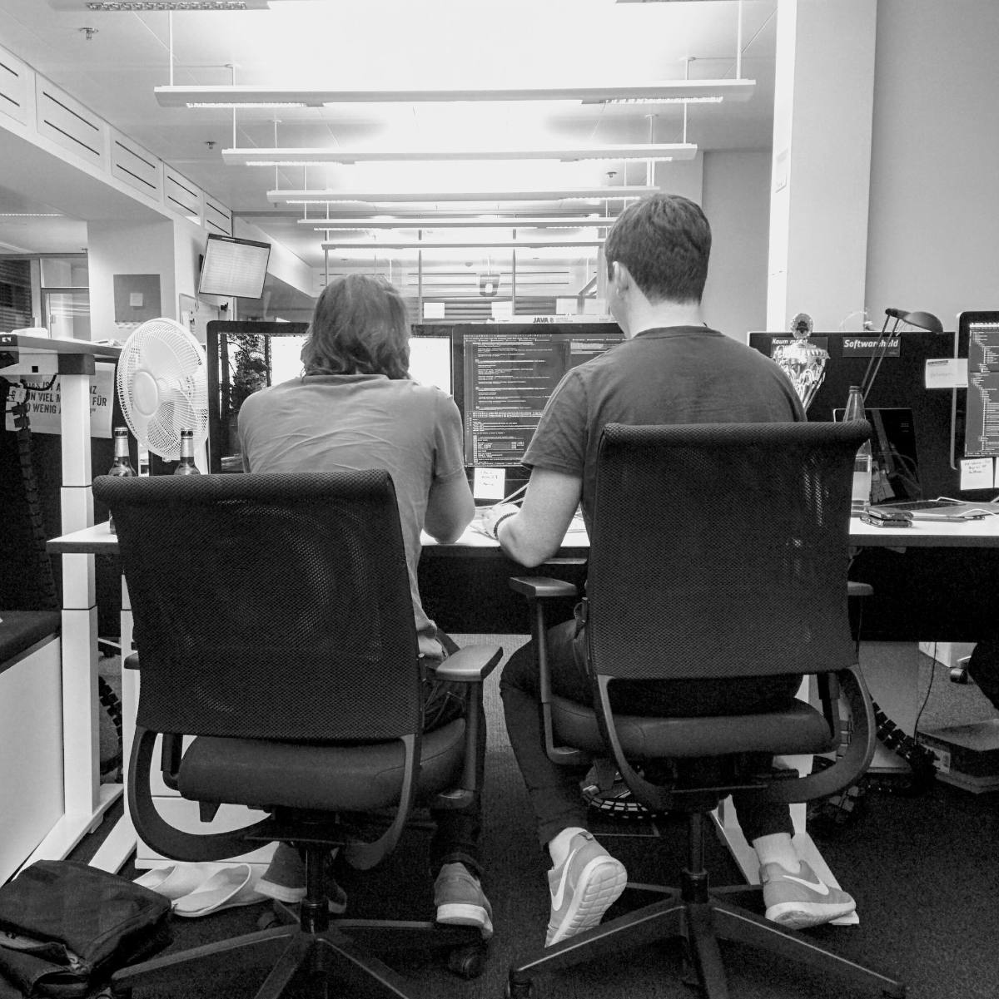
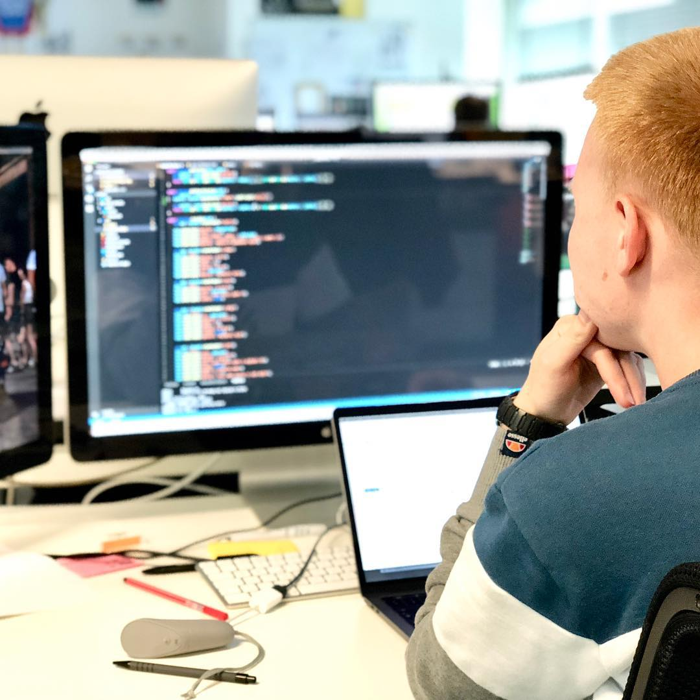

# Recruiting 2.0: Talk is cheap, show me your code

# 

Ich würde niemals bei einer Firma als Entwickler anfangen, die sich nicht meinen Code anschaut. Auch weiß ich immer gerne vorher, wie es wäre, bei einer Firma zu arbeiten. Wie riecht dort die Luft? Genau so gestalten wir deswegen auch den zweiten Teil unseres Bewerbungsprozesses: Zeig uns was du kannst und wir zeigen dir, wie du bei uns später arbeiten wirst.

Bei meinem ersten Job als Entwickler hatte ich nur ein Vorstellungsgespräch, bei dem hauptsächlich mir Fragen gestellt wurden und ich musste die Lösung für ein Problem an einem Whiteboard skizzieren. Also klassische Situation: Ich der Bewerber, der unbedingt einen Job will, dort das Gremium, das entscheidet. Heutzutage würde mich beides abschrecken: Einseitiges Bewerbungsgespräch und keine Coding-Challenge. Nehmen die denn jeden?

Dieser Post ist Teil einer kleinen Artikel-Serie, wie man aus meiner Sicht modernes IT-Recruiting gestalten sollte. Im [vorherigen Post](https://axelspringerideas.de/blog/2018/05/wie-machen-wir-bei-ideas-engineering-eigentlich-recruiting/) habe ich bereits erklärt, wie wir das Thema Recruiting generell angehen, nämlich als Dialog, ein gegenseitiges Kennenlernen. Und wie der generell Ablauf ist. Bei Entwicklern bleibt aber eine Frage immer im Vordergrund: Ob und wie man ihre Fähigkeiten beim Programmieren testet und beurteilt.


# Ist so ein mehrstufiger Prozess überhaupt noch zeitgemäß?
Entwickler sind selten, besonders bei uns in Berlin. Eigentlich kann man sich fast aussuchen, für welchen Arbeitgeber man arbeiten will. Deswegen auch die Gretchenfrage: Ist es noch zeitgemäß, dass man nicht nur ein, sondern sogar zwei/drei Gespräche führt? Die klare Antwort: Unbedingt!

Denn es hat Vorteile, auch für den Bewerber: Gerade wenn man als Entwickler die freie Wahl hat, sollte sich der Arbeitgeber so professionell und ansprechend wie möglich präsentieren. Eine Arbeitsprobe gehört dazu. Es ist nicht nur mehr Zeit, um sich gegenseitig besser kennenzulernen, man lernt auch den Arbeitsstil des Kandidaten und die Erwartungen des Arbeitgebers besser kennen.

Und aus Arbeitnehmersicht: "Hiring bad developers is like drinking seawater. It seems to satisfy a need while actually increasing it.” (von [Michael Nygard](https://www.amazon.de/Release-Production-Ready-Software-Pragmatic-Programmers/dp/0978739213)) Deswegen nimmt man sich die Zeit und Mittel einen Bewerber ausreichend zu beurteilen. Man darf den kulturellen Einfluss, den ein neuer Mitarbeiter hat, nicht vergessen. Dazu ist auch das Nicht-bestehen der Probezeit immer ein Schlag für das Team. Deswegen gilt: Nehmt euch die Zeit dir ihr braucht, um einen Kandidaten zu beurteilen!

Und für beide Seiten ganz wichtig: Auch Quereinsteiger und Leute mit (noch) nicht passendem Lebenslauf können durch eine Coding Challenge eine Chance bekommen sich zu beweisen.

# 

## Was soll man testen: Algorithmen, Whiteboard-Tests, Zeitkomplexität?

Mir fällt auch kein besseres Wort dafür ein: Beim Entwickeltest muss jeder programmieren. Keine Algorithm, kein Whiteboard, keine theoretischen Fragen. In einem guten Test kann man keine Punkte erreichen, kann nicht alles schaffen und es gibt auch keine richtige Lösung. Der Code ist immer nur Diskussionsgrundlage: Warum wurde was gemacht, wie geht man vor, wie arbeitet man. Wie die Lösung aussieht, ist eher zweitrangig. Die Frage ist eher: Wie arbeitet man und wie präsentiert sich der Bewerber.

Hausaufgabe oder Vor-Ort? Wir präferieren meistens den Test bei uns Vor-Ort. Ja, das kostet auch uns mehr Zeit. Aber der Bewerber bekommt die Möglichkeit, direkt bei uns im Team zu sitzen. Wir sind hier aber nicht dogmatisch. Gerade bei etwas unerfahrenen Entwicklern oder bei Persönlichkeiten, die zu starker Nervosität neigen, kann der Test in abgewandelter Form auch in Ruhe zuhause erledigt werden.

Auf eine Sache sollte man bei Hausaufgaben achten: Die Aufgabe sollte nicht zu offen sein. Ein Bewerber würde hier vielleicht zu viel Arbeit hineinstecken, was nicht fair wäre. Klare Richtlinien helfen hier: Zeig uns was du kannst, lege Wert auf Qualität, nicht Quantität.

Findet der Test bei uns im Büro statt, sieht das in der Regel so aus: Wir laden ein und kommunizieren auch gleich die Agenda - der Bewerber soll sich vorbereiten können und grob wissen, was auf ihn zukommen. Bei den Zeiten sind wir total flexibel, es kann auch erst sehr spät oder sehr zeitig losgehen – das entscheiden wir normalerweise im Prozess gemeinsam mit dem Bewerber. Diese Zeiten hier sind daher ein Beispiel:  

* 9.45 Uhr Ankunft, Vorgespräch mit Getränken und Erklärungen zum Ankommen
* 10 - 12 Uhr: Zeit für den Code!
* 12 - 12.30 Uhr: Auswertungsgespräch
* 12.30 Uhr gemeinsames Mittagessen mit dem potentiellen Team (optional, aber gewünscht) und anderen begeisterten Ideas Engineering Kollegen

## Und wer macht den Test mit dem Bewerber?

Alle Entwickler. Bei uns bekommt jeder Kandidat einen “Zeremonienmeister”, der sich für den gesamten Ablauf der Bewerbung verantwortlich zeigt, ihn durch den Test begleitet und alles vorbereitet, sowie die Kommunikation übernimmt. Er sammelt am Ende Feedback ein, konsolidiert es und gibt es weiter.  

Für die Auswertung nach dem Test sucht er sich 1 bis 2 Kollegen aus, die ihn unterstützen und bei der Bewertung und Einordnung helfen. Manchmal sind noch Zuschauer anwesend, denn bei uns sind alle neugierig. Wir versuchen aber die aktiv Fragenden auf 2-3 zu reduzieren, es soll kein zu starkes Ungleichgewicht geben.

Es hat sich aber gezeigt, dass hier (wie nicht anders zu erwarten) einige wenige Personen besonders aktiv sind. Das ist auch nicht schlimm, den nicht jeder soll alles machen. Es fühlen sich einige besonders stark verantwortlich für das Recruitment und bringen sich stark ein und das ist toll.

Und nicht vergessen: In keinem Schritt der Bewerbung ist es akzeptabel, dass ein Bewerber länger als 24h auf irgendeine Antwort wartet.

Let’s get real: Der Test
Wir hatten Tests in ganz vielen Geschmacksrichtungen: Für JVM-Backend, Ruby, Android, Frontend. Ja, es gab auch bereits einen in PHP! Generell suchen wir leidenschaftliche Entwickler, wie im [ersten Teil](https://axelspringerideas.de/blog/2018/05/wie-machen-wir-bei-ideas-engineering-eigentlich-recruiting/) der Serie beschrieben. Trotzdem haben wir auch Rahmenbedingungen: Es wird wahrscheinlich keine Ruby-Anwendungen bei uns geben und mit .Net werden wir auch nicht anfangen. Deswegen sind Entwickler, die dies unbedingt machen wollen oder als ihr Steckenpferd ansehen bei uns nicht gut aufgehoben.

Ich gebe euch ein Beispiel, denn hier ist der PHP-Test, den wir hoffentlich nie wieder brauchen. Dazu kurz die Regeln:

* Man kann in der Zeit nicht alles schaffen.
* Es gibt kein Richtig oder Falsch, der Ansatz zählt.
* Es gibt freies Internet, man kann den eigenen Rechner nutzen, niemand schaut über die Schulter.
* Man kann jederzeit Zwischenfragen stellen oder nachfragen, wenn man an einer Stelle hängen bleibt.
* Man bekommt zwei Stunden Zeit.

## Ein Beispiel für PHP-Entwickler

```
Please work on as much as you can in affordable time.
Please rather deliver less in high quality than more in lesser quality.

Your code should be production ready.

Hints:
   * Use the IDE, Tools, Librarys or Framework you are most comfortable with
   * Prefer simple solutions - don't make it too fancy

## Task 001 - Setup & Build-Tools

   * Create a project setup with your favorite build tool
   * Your build should generate a deployable artifact, eg. it should be deployable

## Task 002 - Unit-Test

   * Write a unit tests for the class ArraySorter
   * Your build should run the tests automatically on each build
   * Explain the reasons for your test-cases as doc/comment

    class ArraySorter
    {
        public function sortArray($array = null)
        {
            $result = $array;
            sort($result);
            return $result;
        }
    }

## Task 003 - Database

   * Connect your application to our database
   * The database has two entities, stars and universes
   * A star has one universe, a universe has multiple stars
   * The database is a mysql database
       * {credentials}

## Task 004 - Rest-API

   * Expose all universes in your first endpoint
   * A second endpoint should have the universe id as path parameter and should
     return all stars from this universe
   * Your API should be RESTful expose all data as JSON

## Task 005 - Website

   * Create a simple website with a button to display the results from your API
      * Display all universes
      * Display all stars from a choosen universe
   * You should have an input form for choosing an id of an universe
```
   
Dazu gibt es noch zwei Bonus-Tasks, die wir oft mit dem Bewerber direkt im Auswertungs-Gespräch durchgehen. In dem Beispiel z.B. bestehender PHP-Code und der Bewerber muss über Sicherheitslücken und Security nachdenken. Oder drei Möglichkeiten in PHP einen String umzudrehen. Diese sind hauptsächlich als erweiterte Gesprächsgrundlagen bei Bedarf und für besonders erfahrende Entwickler gedacht.

## Wie wird gewertet?

Das ist die schwierigste Frage: Es gibt kein richtiges oder falsches Erledigen der Aufgaben. Es gibt nur den Eindruck, den jeder von uns beim Gespräch mit dem Bewerber erhält. Ist er ein [Expert Beginner](https://daedtech.com/how-developers-stop-learning-rise-of-the-expert-beginner/), der seine Fähigkeiten völlig falsch einschätzt? Oder kann er wirklich entwickeln? Der Test dient schließlich der Bewertung seiner technischen Fähigkeiten, der Hard Skills.

Wir stellen dazu natürlich Fragen zu den Aufgaben. Wie testet der Bewerber? Welche Frameworks kennt er? Wieso hat er etwas auf welche Art gelöst? Ist er in ähnliche Probleme geraten? Wie schätzt er seine Fähigkeiten an? Was fand er schlecht, was fand er gut, worauf legt er Wert?

Am Ende geht es nämlich nicht um den Test selbst, sondern um das Gespräch und den Eindruck, den der Bewerber uns vermittelt. Es geht auch nicht um Vergleichbarkeit! Jeder Mensch und damit jeder Bewerber ist unterschiedlich und das reine Absolvieren eines Tests würde nie eine Vergleichbarkeit gewährleisten. Es gab auch Bewerber, bei denen wir so überzeugt waren, dass sie den Test nicht absolvieren mussten. Wie erwähnt: Flexibilität muss auch beim Recruiting möglich sein.

Natürlich fließt in die gesamte Bewertung mit ein, wie gut seine bisherigen Erfahrungen und sein Tech-Stack bei uns in die Firma und Kultur passen. Ein Entwickler mit Erfahrung in Java und mit modernen Java-Script Frontends mit AWS-Vodoo-Skills ist für uns einfach besser, schneller und universeller einsetzbar.

## Last, but not the end

Was gibt es noch zu sagen? Genau: Welche Fehler haben wir auf dem Weg zu diesem Prozess gemacht, was haben wir gelernt. Das erfahrt ihr im dritten Teil der Serie zu Recruitment 2.0. Denn es gibt noch viele offene Punkte: Was ist mit der Probezeit? Wurden auch die falschen Leute eingestellt? Hat das alles immer reibungslos funktioniert?

* [Recruiting 2.0: Wie wir bei Ideas Engineering rekrutieren](https://axelspringerideas.de/blog/2018/05/wie-machen-wir-bei-ideas-engineering-eigentlich-recruiting/)
* Recruiting 2.0: Talk is cheap, show me your code
* 10 Typische Fehler bei Code Challenges und wie man sie vermeidet (coming soon)
* Recruiting 2.0: How to hire Agile Coaches & Product People (coming soon)
* 7 Fehler, die jeder auf dem Weg zum Recruitment 2.0 macht (coming soon)
