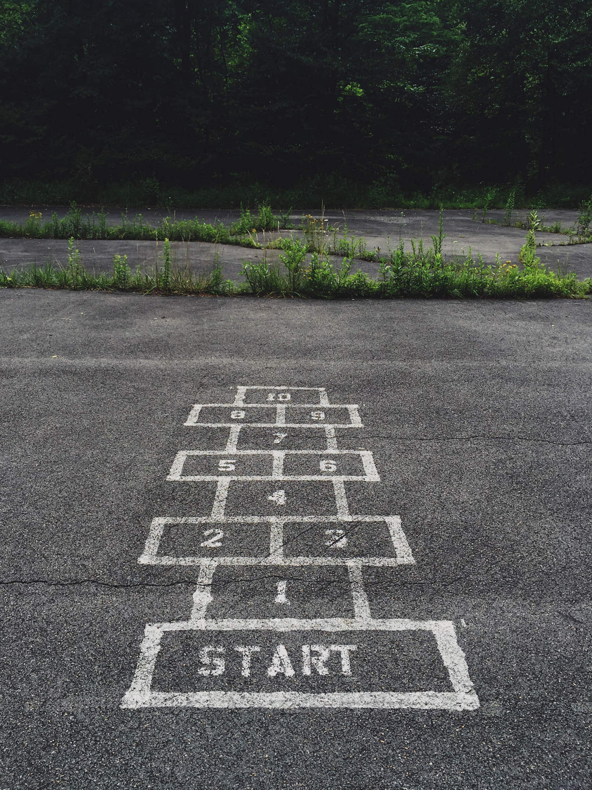

# How To Build A Ferrari... Despair & Find Your Way Back... 
Once upon a time there was a pitch to win over a project…This story is not about winning the pitch. The internet is full of success stories and awesome Power Point orgies about pitches. Our story begins where their stories end. 

## We Won The Pitch - Now We Gotta Build The Ferrari
We asked the mighty internet how to tackle this fabulous task. How would we climb Task-Everest? We had to practically invent the wheel within our team from scratch. Not really because no one ever build a Ferrari before, but because we have to handle new technology, a whole new way of thinking. We made sure to get some help for our quest from a knight in shining armor. Our freelance-knight brought extended knowledge to the fight and so the story begins… 

# 
 
## Bringing Them To Camelot
We’re a team that already overcame the storming phase & already established a very well working relationship. Our team is build on trust - we truly rely on each other. Facing that & starting a project from scratch in a field that none of us has ever approached before is a great thing. Naturally, we encountered challenges which were new to us. Some thoughts & questions on those challenges: 
*	What are we building actually?  
*	Who is going to benefit from it? 
*	How can we trace our success or failure? 
*	How can we make sure we’re providing high quality software in a field none of us tackled before?  

# 

I could bore you with more *challenges*. In the end we had to adress those issues rather than trying to delay the upcoming Armageddon. What did we do so we were able to move on? You guessed right - we had two meetings!
 
# 
 
The first meeting we had was planned to align ourselves along the same given information, goal and outcome. Catastrophe doesn’t really do it any justice - from my point view I was quite disappointed. I was absolutely convinced that all team members had the same understanding of what we’re trying to achieve & just the how is the challenge we have to overcome. I was simply on the wrong track. Each & every single team member had a different view which was not only soul crushing to me, but also a serious threat to the project’s success. Luckily, we’re an awesome team. We reviewed the result of our meeting and got back to square one.
 
# 
 
For the second meeting we took a different approach. We asked ourselves how we’d like to present our results within the projects lifetime. It wouln’t work based on our pitch or so our assumption. We agreed to show off our work with each step - we’d need a target group to focus on & a story to tell. Today we present our results by building Showcases that enclose the requirements/features based on our pitch.
 
## The Showcases 
A showcase starts with an idea and cross-check with the pitch. From this point on I’ll ask myself the following questions in order to come up with a new showcase: 
1.	Does the showcase fulfill one or more requirements/feature?  
2.	Who is my target audience - are software developers going to benefit from the showcase or is it something appealing to editors? 
3.	Can we actually build the showcase? 
4.	Do we need to splice the showcases into more manageable versions? 
 
From this point on and given the assumption that the team agreed on building the showcase we’ll provide the following deliverables:  
1.	Landingpage for each showcase which includes a description & examples 
2.	Login credentials so we can track if anyone actually uses our landingpage 
3.	Eventually some graphic representation of some of the concepts behind our showcases 
4.	Contact information so people can approach us in order to receive login credentials and give feedback  

## Snapshot Status Oct. '18 
It works, kinda like…. We established a working process building new showcases. You need proof? It’s 12 a.m. on Friday 11th October and the team is working not because they must but like to. We fled the office to have some quality team time & connect work with fun. We need to refine some steps for sure but now - it works! We’re focused, we can present more than just code and cryptical explanations. We’re planning roadshows in order to present our showcases and gather more information on how and why journalists, editors, software developers and business people might make use of our showcases. They became a tool to get the conversation started. What do they like about a certain showcase? Why doesn’t it fit their use case, and which use case or problem are they trying to solve?
  
# 
  
## Conclusion 
When you try to build a Ferrari the 1st time you’ll encounter several challenges. Don’t give up - talk to your team & be open about it. Nothing is worse than total silence & polite smiling when you feel like using your Shouting Vase all day long. We’re half way through our time budget building the *Axel Springer Knowledge Graph* and we’re certain to find more showcases we can build to benefit use cases for Axel Springer along the way. Stay tuned, stay excited and click here to get more information on potential use cases for your business.
 
# 
