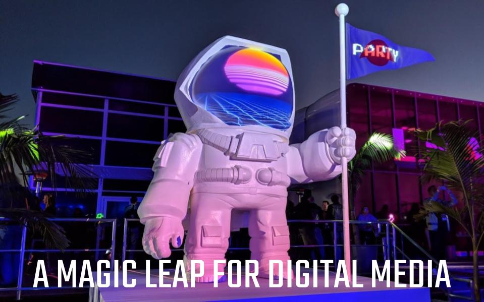
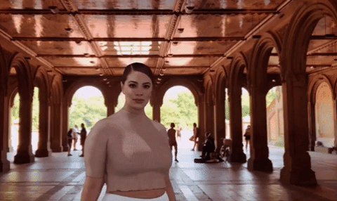
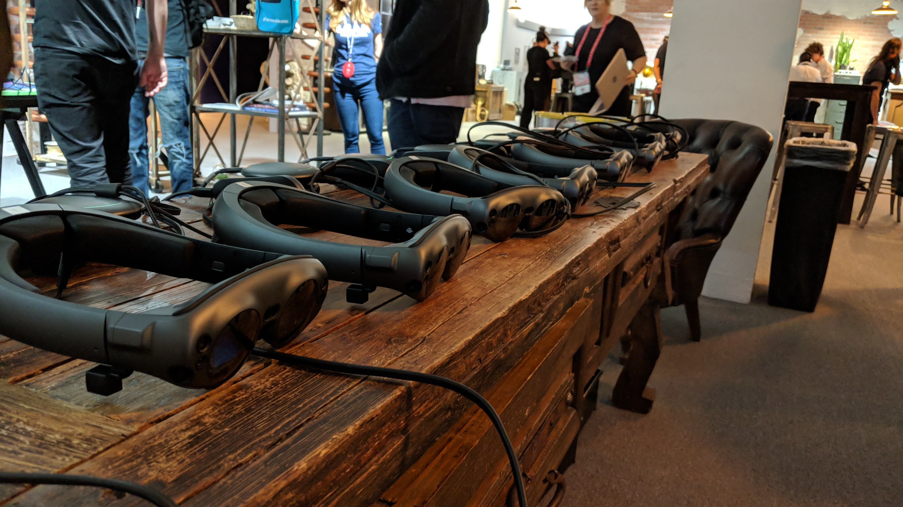
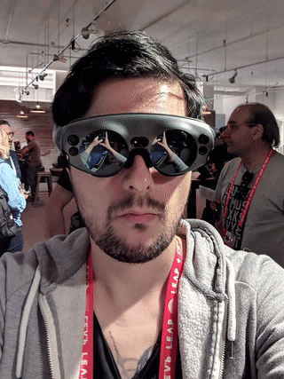

# A Magic L.E.A.P. for Digital Media
# 
Die letzte digitale Revolution liegt nun schon über ein Jahrzehnt zurück, der Smartphone-Markt ist gesättigt, die Innovationsrate ist rückläufig und neue Geräte heben nur noch wenige Augenbrauen. Die nächste digitale Revolution steht also vor der Tür, doch noch ist sie nicht vollständig hindurchgegangen.

Warum könnte es Virtual Reality (VR), Augmented Reality (AR) oder sogar Mixed Reality (MR) werden? Axel Springer Ideas Engineering hat seine Fühler bis in das ferne Los Angeles ausgestreckt, um dieser Frage nachzugehen.

# 

## Was ist Mixed und Augmented Reality?
Im Gegensatz zu Virtual Reality blendet Augmented Reality die Realität nicht komplett aus, sondern erweitert diese. Mixed Reality geht dabei noch einen Schritt weiter und lässt virtuelle und reale Objekte realistisch miteinander agieren. Man kann VR auch als Subset von MR verstehen, in der die Realität so weit ersetzt wird, dass sie vollständig verdeckt ist.

Während die Stärke von VR, dem “Kopfhörer für die Augen”, die Ausblendung der Realität, dem entsprechenden Fokus auf den Inhalt und der damit häufig einhergehenden Isolation von der Außenwelt ist, bezieht Mixed Reality die Außenwelt aktiv mit ein, sie wird Teil der digitalen Welt. Die große Herausforderung dieser Technologie ist die glaubwürdige Interaktion realer und virtueller Objekte im Raum, d.h. virtuelle Objekte müssen von realen Objekte verdeckt und manipuliert werden können.

AR und MR (und eigentlich auch VR) funktionieren nicht nur stereoskopisch, sondern auch auf zweidimensionalen Bildschirmen. AR ist dort schon längst angekommen, auch Axel Springer stattet ihre Print-Magazine bereits mit AR Inhalten aus, die mit der entsprechenden App konsumiert werden können. Die New York Times integriert ihre technologisch beeindruckenden AR Inhalte bereits nahtfrei in ihre digitalen Artikel.

# 

Doch hier soll es nicht enden.
Die nächste logische Entwicklungsstufe ist die Ablösung des Smartphones und die stereoskopische Darstellung von MR Inhalten direkt auf unseren Augen: die Mixed Reality Brille.
 
## Die Magic Leap One
# 
Nach den Google Glasses (eine AR Brille), der Microsoft Hololens (MR Brille) steht uns mit dem gut finanzierten Startup "Magic Leap", der nächste Anwärter auf eine nutzbare Mixed Reality Brille ins Haus.

Nicht zu früh wurde die Developer Version der Magic Leap One vorgestellt und auch gleich eine Haus-Konferenz, die L.E.A.P. Konferenz, ins Leben gerufen. Tarek und ich von Axel Springer Ideas Engineering nahmen den langen Weg ins kalifornische Los Angeles auf uns, um den Stand der Entwicklung zu untersuchen, die Magic Leap One nach Deutschland zu holen und Erfahrungen zu sammeln, wie wir heute schon Inhalte für die nächste Medien-Generation entwickeln können.

Zu Allererst: Die Magic Leap One funktioniert! Die Brille ist keine ewige Zukunftsvision, sondern funktioniert schon heute. Die vier Kameras an der Vorderseite des Geräts erstellen nach dem Aufsetzen kontinuierlich ein 3D Modell der realen Umgebung und erlaubt das Ausführen von Apps im eigenen Wohnzimmer oder Büro. Das Tracking ist bei normaler Ausleuchtung beinahe perfekt: Die virtuellen Gegenstände bleiben auch bei hektischen Bewegungen an ihrem Platz. Die Brille ist angenehm zu tragen, leichter als erwartet und auch das Design setzt neue Maßstäbe für HMDs.

Auch Kritikpunkte konnten wir finden. Am gravierendsten erschien uns das sehr eingeschränkte Gesichtsfeld der ersten Version der Hardware. Die One selbst trägt sich wie eine Sonnenbrille und verdeckt nur wenig des peripheren Blickfelds, doch die frisch gemixte Realität erscheint nur in einen quadratischen Bereich in der Mitte des Gesichtsfelds. Man kann es sich so vorstellen, als hätte man einen iPad-großen Rahmen ca. 40cm vor dem Gesicht. Das funktioniert, schmälert aber die Immersion.

Es ist dabei zu Bedenken, dass es sich derzeit nur um die Developer Version der Hardware handelt und bis wir die Magic Leap als echtes Consumer-Produkt in den Händen halten, kann sich daran noch viel ändern.

## Die Zukunft ist augmented!
Wir glauben daran. Magic Leap, Facebook, Microsoft und Google werden Recht behalten: MR funktioniert und wird unser tägliches Leben erneut auf den Kopf stellen. Der Besuch auf der L.E.A.P. Conference hat uns gezeigt, dass die Technik wirklich funktioniert! Es führt kein Weg daran vorbei: Wir werden bald nicht mehr verstehen, wie wir uns damit begnügen konnten auf kleine Bildschirme in unserer Hand zu schauen, anstatt einfach eine Brille aufzusetzen und beinahe zu vergessen, dass wir gerade einen Computer benutzen. Unsere Büroschreibtische werden leer sein, denn wozu schwere, statische Monitore, wenn man sich mit zwei Klicks vier virtuelle Bildschirme jeder Größe erstellen kann? Wie konnten wir damals so umständlich googeln, wenn wir den Baum jetzt nur noch anschauen müssen, um zu wissen wie er heißt?

Noch benötigt es zweifelslos Visionäre, um den Weg zu ebnen! Doch bei Magic Leap sind sie vorhanden, das wurde uns bei jedem Panel auf der L.E.A.P. Conference klar. Das Ziel ist ein neues digitales Medium, dass die Grenzen zwischen Menschen überall auf der Welt einreißen, die Nutzung von Computern erbarmungslos vereinfachen und beinahe alle unsere bisherigen Medien ersetzen oder erweitern kann.

Im Ideas Engineering VR Lab ist Mixed Reality nur einen kleinen Schritt entfernt, doch wird es ein gigantischer L.E.A.P. für die digitalen Medien.

# 
