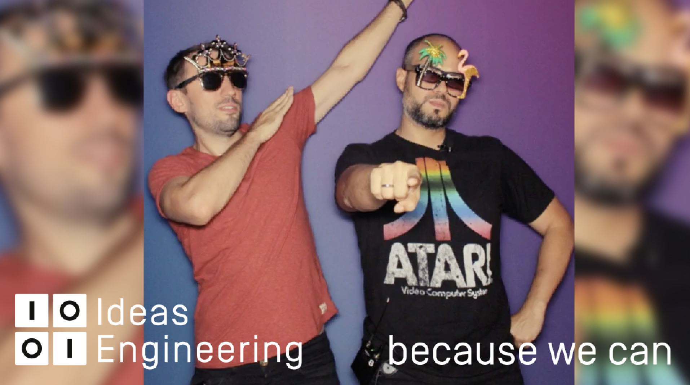
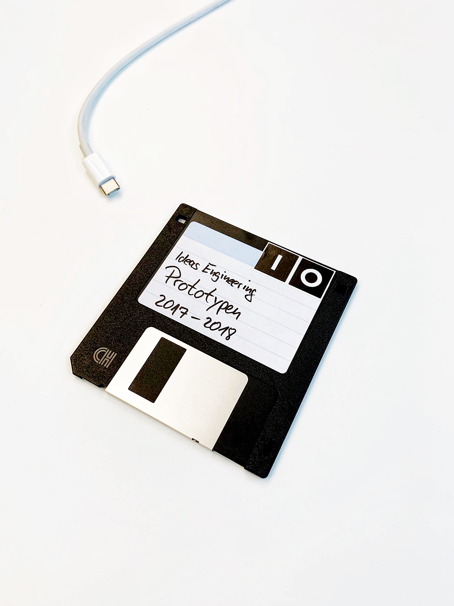

# Kultur kann man nicht managen: Cultural Hacks zum selber Ausprobieren

Als Axel Springer Ideas Engineering wurden wir im Jahr 2013 als "agile Firma für zentrale Software Entwicklung" gegründet. Fast keiner unserer Kollegen hat vorher bei Axel Springer gearbeitet. Wir waren unabhängig, idealistisch und wir waren hungrig darauf, agiles Arbeiten auszuprobieren. Wir wollten modernes Arbeiten leben. Selbstorganisation war das Zauberwort. Es gab nur ein Problem: Wie schafft man es, dass Teams und Mitarbeiter mehr Verantwortung übernehmen? 

Und die Antwort: Mit der richtigen Kultur. Kennt ihr die Aussage, "Kultur verspeist Strategie zum Frühstück”? Sie stammt angeblich von Peter Drucker. Er meint damit, dass die Kultur einer Organisation einen deutlich stärkeren Einfluss hat, als es Vision, Werte, Ziele, Strategien, Projekte, etc. je haben werden. In der heutigen "New Work" Arbeitswelt sprechen alle über Kultur. Alle wollen eine großartige Kultur! Nur leider kennen wir vor allem die Arbeitswelt der Vergangenheit. Diese haben wir erlebt, verinnerlicht, die kennen wir. Unsere Methoden und Herangehensweisen auf der Arbeit, unsere Verhaltensweise, sind davon geprägt. Das macht Dinge wie Verantwortung übernehmen und Selbstorganisation nicht einfacher - denn hier kennen wir weder die Werkzeuge, noch haben Übung darin.

Gerade in Zeiten, in denen [intrinsische Motivation]() immer wichtiger wird, wo wir bereits von [Management 3.0]() sprechen und mit dem [Warum]() anfangen, ist die Aussage von Drucker so wahr wie noch nie. Kultur ist deswegen auch kein Selbstzweck! Sie ist heute der entscheidende Faktor für eine nachhaltige und erfolgreiche Firma. Sie beeinflußt nicht einfach nur die Verhaltensweise von Mitarbeitern, sondern auch deren Haltung. Die erste Frage bleibt aber: Was ist denn die Kultur einer Organisation eigentlich? Und die zweite Frage ist: Wie beeinfluße ich diese?

# Kultur - das Gedächtnis der Organisation

Leider ist dies kein Artikel darüber, was Kultur ist, sondern wie man sie beeinflußt. Deswegen bleibt dieser Teil auch ziemlich kurz. Das [Gabler Wirtschaftslexikon](http://wirtschaftslexikon.gabler.de/Definition/organisationskultur.html) definiert den Begriff in der Kurzform so: "System gemeinsam geteilter Muster des Denkens, Fühlens und Handelns sowie der sie vermittelnden Normen, Werte und Symbole innerhalb einer Organisation."

Die Kultur einer Firma ist aus der Vergangenheit angelernt und bezeichnet die tatsächlich gedachten und gelebten Systeme. Die Summe der Handlungen und Haltungen. Die kollektive und gelebte Grundhaltung der Organisation. Bei Axel Springer gibt es unglaublich viele verschiedene Marken und Bereiche. Selbst im Haupthaus, wo alle eng beieinander leben, kann man sehr unterschiedliche Kulturen beobachten. Selbst bei Abteilungen, die direkt nebeneinander sitzen. 

Der Versuch es praktischer zu erklären: Wie werden Entscheidungen in der Firma getroffen? Wozu, warum und wie werden Meetings abgehalten? Was sieht man als Teil des eigenen Aufgabenbereichs? Wie wird mit Informationen umgegangen, wie werden Neuigkeiten kommuniziert? Wie arbeitet man zusammen? Wie wird Führung gelebt, wie wird sie defininiert? Wie funktioniert die Kommunikation? Die Antworten auf diese Fragen sind immer unterschiedlich, aber eben diese Antworten definieren, was die Kultur einer Firma ist.

# Kultur kann man nicht managen

Also, Butter bei die Fische, wie beeinflußt man die Kultur? Beim klassischen Change Management fängt man mit einer Analyse der IST-Situation an und leitet dann Maßnahmen ab. Die Frage ist aber nicht: Wie können wir andere Menschen verändern? Diese Haltung spiegelt den traditionellen Ansatz von Management wieder. Menschen sind komplex, teilweise chaotisch. Wie will man ein komplex-chaotisches System managen? Gar nicht! Kultur kann man nicht managen. Was man kann, ist direkt beim Mitarbeiter anzusetzen. Gewohnheiten aufbrechen, Routinen verändern. Also minimale Eingriffe in die Zusammenarbeit vornehmen. 

Aber was sind jetzt "Cultural Hacks”? Als einen Hack bezeichnet man sehr grob gesagt den Zugriff auf etwas, was man normalerweise nicht einfach erreichen kann. Neben klassischen Hacks bei Computersystemen, bei denen man Zugriff auf geschützte Bereiche erhält, gibt es auch “Life Hacks”. Dabei geht es um kleine praktische Tricks und Tipps, mit denen man Dinge schneller oder besser erledigen kann. Beim "Cultural Hacking" geht es darum, die kleinen Dinge zu finden, die man jeden Tag tun kann, um positive, iterative Veränderungen zu bewirken. Es klingt vielleicht nach einer schnellen und nicht nachhaltigen Lösung, aber es ist mehr als das. Wie bei der agilen Softwareentwicklung geht es darum, sich häufiger auf kleine Dinge zu konzentrieren, anstatt nur zu versuchen, die großen Dinge anzugehen und zu verändern.  Ein Cultural Hack ist also ein praktischer Tipp, wie man an der Kultur des Unternehmens arbeiten kann. 

Und das sind hier sind unsere Erfahrungen, aus denen ihr vielleicht lernen könnt. Ein paar unserer Cultural Hacks, die ich gut fand. Dabei wir nicht nur der Hack selbst beschrieben, sonder auch *warum* dieser Hack unsere Kultur positiv beeinflußt hat und *wie* er durchgeführt wird. Um es euch einfach zu machen, wird jeder der Hacks bewertet, nach Punkte, wobei 5 das Maximum ist:

* Durchführbarkeit / Feasibility: Wie einfach kann man das einführen? Würde dieser Hack auch in einer Anwaltskanzlei möglich sein? Oder muss man bereits eine sehr fortgeschrittene Kultur haben? Braucht man viel Vorbereitung? Oder kann man schnell und einfach loslegen?
* Kulturelle Wirkung / Cultural Impact: Wie stark wirkt sich dieser Hack auf die Kultur aus. Ist er nur ein weiterer kleiner Baustein? Oder kann er direkt die ganze Organisation umkrempeln?
* Begeisterungsfähigkeit / Awesomness: Wie einfach begeistert man damit Leute? Wie originell und wie genial ist dieser Hack? Oder ist er zwar hilfreich, reizt aber wenig vom Hocker?

# 

In den nächsten Tagen wird deswegen jeden zweiten Tag ein Cultural Hack veröffentlicht, hier habt ihr bereits die Liste:

* Cultural Hack #1: Die Kudos-Box aus dem Schuhkarton
* Cultural Hack #2: Und wie geht's uns denn heute? Nico-Nico Kalender mit TeamMood.com
* Cultural Hack #3: We are Legion: Anonyme Suggestion-Box
* Cultural Hack #4: Zeitmessung mit Lego: Was haben wir eigentlich die ganze Zeit gemacht?
* Cultural Hack #5: Team Budgets aka "Wir wollen einen Billiard-Tisch"
* Cultural Hack #6: Urlaubsplanung mal anders
* Cultural Hack #7: Lebenslanges Lernen? Dann aber bitte mit Bücherbudgets!
* Cultural Hack #8: Und was ist wenn er uns dann verlässt? Weiterbildungen für alle.
* Cultural Hack #9: No Coffee? No Worky! Belohnungen für Teams, nicht für Einzelne
* Cultural Hack #10: Tod den Meetingräume
* Cultural Hack #11: Ein bisschen Huddle - Inverses Reporting
* [Cultural Hack #12: Hacksite - Klassenfahrt mit Arbeitsbezug](https://axelspringerideas.de/blog/2018/11/hacksite/) von [(Macro Böttcher)](https://www.linkedin.com/in/marco-b%C3%B6ttcher-55a74324/)
* Cultural Hack #13: Anti-Hacks: Vom Shit-O-Meter bis Fuck Up Wand
