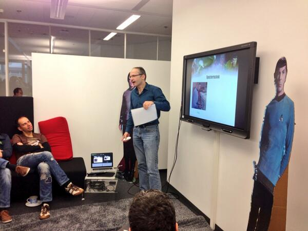
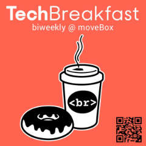
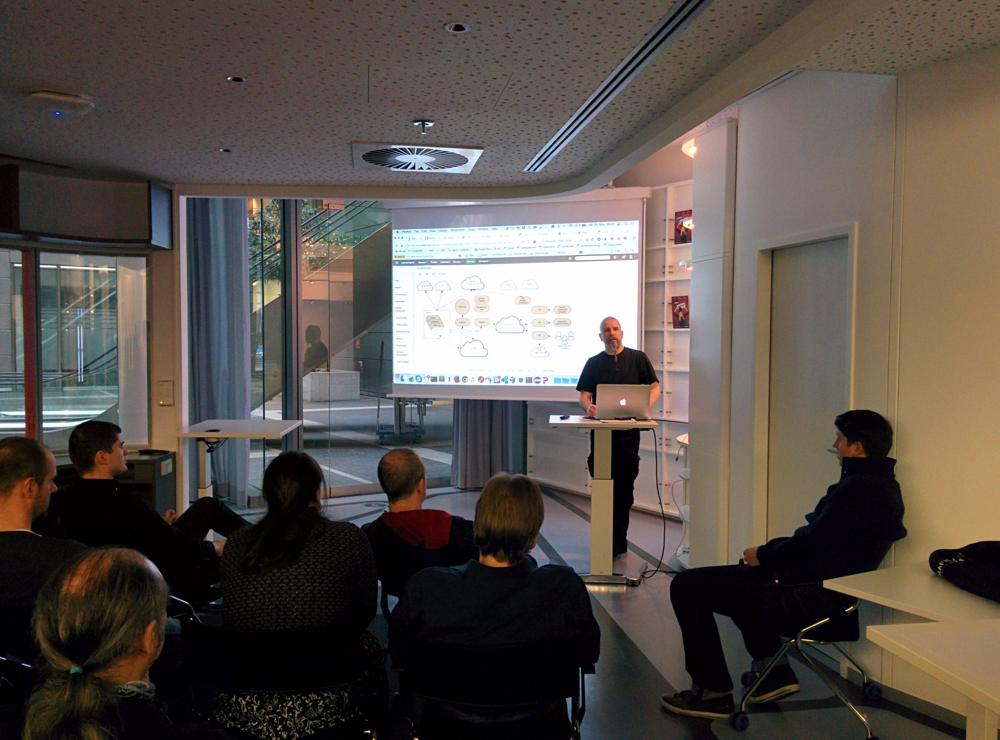
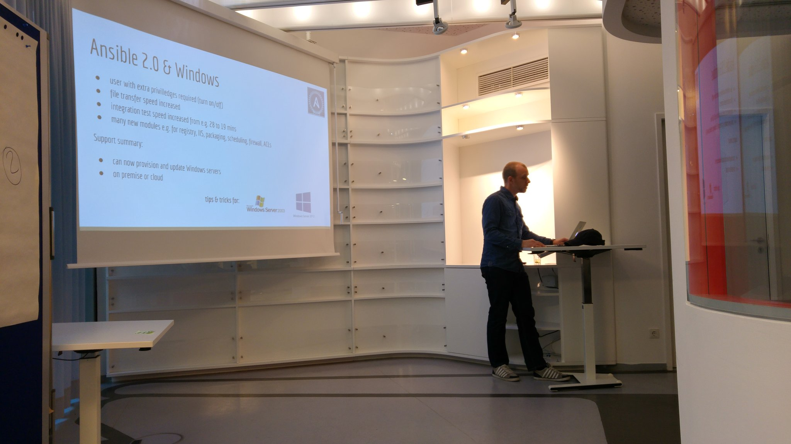
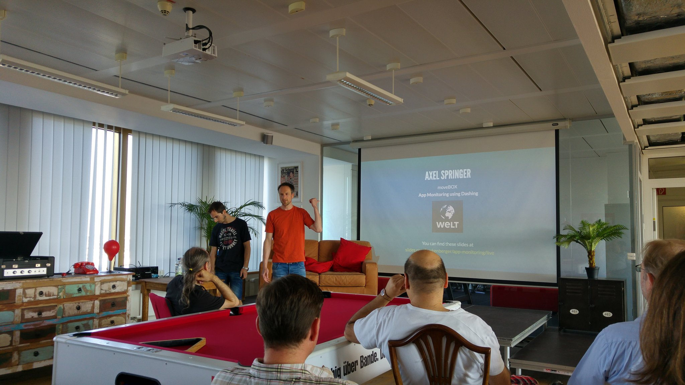
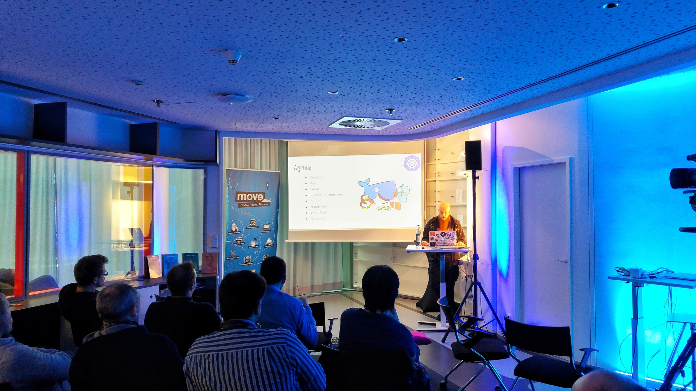
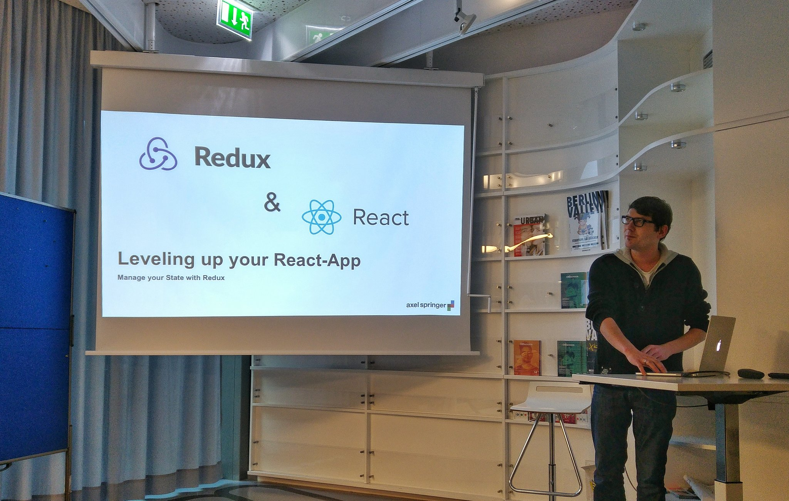

# 
# Techbreakfast est. 2013: Eine Geschichte von vielen Croissants

Als wir 2013 gegründet wurden, hatten wir den Anspruch eine von Entwicklern geführte Firma zu sein. Technische Exzellenz und moderne Technologie hat für uns daher immer dazu gehört. Aber wie verankert man das in seiner Kultur und wie bleibt man offen für neue Technologie? Eine Antwort für uns war die Gründung des "OpenTechBreakfast" als Ort des offenen Austausches. Eine [Brown-Bag-Session](https://de.wikipedia.org/wiki/Brownbag) mal anders! 
 
Aber ist das etwas für Entwickler? Vorträge halten, sozial sein, nicht am Rechner sitzen? Wie sich gezeigt jat: Ja! Denn seit fast 6 Jahren ist das Format für uns extrem erfolgreich. Sich mit Kollegen und Kolleginnen darüber austauschen, was sie in der Welt der Technologie beschäftigt, oder die coolsten Projekte vorzustellen. Das trifft einfach einen Nerv. Deswegen hier eine kurze Geschichte und viele Bildern aus mehreren Jahren TechBreakfast.

Was wir bei der Organisation und dem Durchführen gelernt haben, erfahrt ihr [hier in einem extra Blog-Post](https://axelspringerideas.de/blog/2019/01/how-to-organize-a-tech-breakfast/).

## 2013: Was ist eigentlich eine Brown-Bag-Session oder ein Learning Lunch? 

Eine Brown-Bag-Session ist ganz klassisch eine Veranstaltung, bei der die Teilnehmer essen, während einer ein Thema vorstellt. Bei uns war dies halt ein Frühstück mit Kaffee, Brötchen und Croissants. Super zeitig am morgen um 9 Uhr oder später auch erst um 9.30 Uhr. Die Vorträge sind dabei zwischen 10 bis 15 Minuten lang und lieber kürzer und formloser. Power Point? Erzähl einfach! Oder stell uns dein Projekt und deinen Code vor. Das war damals unser Grundgedanke: Den Austausch fördern.

Deswegen war auch das Anmelden von Vorträge immer sehr einfach: Auf einer Wiki-Seite hat sich einfach jeder eingetragen, der etwa zu einem Thema vorstellen wollte. Das ganze sah dann so aus:

Insgesamt 12 Mal gab es das OpenTechBreakfast im Jahr 2013, einfach in einer Sofa-Ecke, in der etwas Platz war. Hier eine Auswahl der Themen:
 
* 25.09.2013: Introduction meeting format
* 02.10.2013: Git for newbies, Vorstellung Mediahackday, Teamvorstellung Welt Online Dev
* 09.10.2013: ART, SDP
* 16.10.2013: Media Hackday Result Presentation, REM
* 23.10.2013: Immutable Infrastructure, Provisioning with Chef
* 30.10.2013: cssConf, Design Thinking, Rebell
* 13.11.2013: Varnish and Varnish Day at Axel Springer HQ, ommunity of Practice @ideAS, How to get rid of expensive Backend developers 
* 20.11.2013: Core Media Ops and Dev, ideAS Ventures - Was ist das?, Kommunikationstest
* 27.11.2013: Digitales Mentoring, Technische Visionen bei Star Trek und deren Umsetzung
* 04.12.2013: Calabash - Mobile Art, Wissensdynamic in cross functional teams
* 11.12.2013: StarFish, Impact Mapping, Das Celepedia Backend - Die ersten 4 Monate
* 18.12.2013: Design at Celepedia, Swagger

## 2014: Und wöchentlich grüßt der Kaffee

Ein großartiges Jahr für das TechBreakfast: Insgesamt 41 Mal fand es statt! Das war quasi wöchentlich, bis auf einige Ausfälle. Da auch die Anzahl der Zuschauer gewachsen ist, wurde es immer öfters in einen großen Raum im Axel Springer Unternehmerclub verlegt.

Hier eine kleine Auswahl der Themen: 
* Why do we need "Frontend Devops"??
* Women in Media
* New Relic
* Go in a nutshell
* Continuous Performance Management
* Rapid Prototyping with Spring Boot
* Event Tracking mit Logstash + ElasticSearch + Kibana
* Agile Metrics

## 2015: Es wird größer: OpenTechBreakfast wird zum TechBreakfast

16x OpenTechBreakfast und 14x TechBreakfast
* Ein Bericht aus dem Silicon Valley
 * REST with RAML
* Datadog 
* Bericht von der FOSDEM

# 

-> Switch to TechBreakfast

https://docs.google.com/document/d/1HXd8Bfqnc4vLSOaq_McAFEQDaxTzhuta_PiLOSlihxs/edit

* JavaScript auf Server-Seite
* Acceptance Test-Driven Development (ATDD
* Web-Typographie
* Master the Art of CSS Fu – Part 1: How to write CSS Selectors
* How to become a better developer (without coding)

## 2016

21.12.2016: Varnish@BILD

# 2017: Business as usual

# 2018: NewInTech als zusätzliches Format

